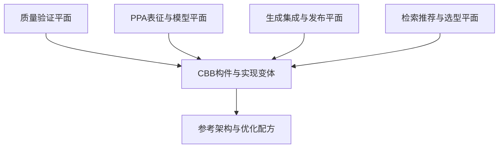

# 面向 PPA 优化的 CBB 库整体规划

> 版本：V1.0  
> 定位：面向 IP/SoC 研发、可由工程师与 AI Skill 共同使用的 PPA 优化基础构件平台

## 1. 规划结论

这套 CBB 库不应只是“参数化 RTL 代码集合”，也不适合用单一 L0～L7 层级描述全部内容。建议将其建设为四类资产、六维分类、四个支撑平面组成的工程体系：

1. **构件资产**：可直接实例化、具有稳定接口契约的 RTL/硬核适配构件；
2. **实现变体**：同一功能契约下，针对面积、频率、功耗和延迟的不同微架构；
3. **参考架构与优化配方**：描述多个构件如何组合，以及在什么条件下采用何种结构；
4. **PPA 数据与证据**：综合、时序、功耗、验证、适用范围和版本回归结果。

在此之上，由四个支撑平面贯穿全部资产：

- 质量验证平面；
- PPA 表征与模型平面；
- 生成、集成与发布平面；
- 检索、推荐与智能选型平面。

最终目标是让系统能够可靠回答：

> 在指定工艺、位宽、吞吐、延迟、频率、功耗模式和接口约束下，哪些构件实现可行，哪几个处于 Pareto 前沿，应选择哪一个，选择依据和验证证据是什么？

---

## 2. 产品定位与边界

### 2.1 核心定位

建议正式定位为：

> **PPA-aware CBB Platform：经过功能验证、实现验证和多维 PPA 表征，可按设计约束自动检索、比较、选型和集成的芯片公共基础构件平台。**

它服务于三类消费者：

| 消费者 | 主要诉求 | CBB库提供的能力 |
|---|---|---|
| RTL/IP 设计人员 | 快速复用，减少重复造轮子 | 稳定接口、实现变体、示例、约束和验证环境 |
| PPA 优化人员 | 找到真正有效的优化结构 | 可比较的 PPA 数据、Pareto 分析、退化检测 |
| AI/Skill | 自动识别、推荐、生成和集成 | 机器可读元数据、规则、API、证据和失败边界 |

### 2.2 CBB、IP、工具函数与参考架构的边界

| 类型 | 判断标准 | 示例 | 是否属于可实例化CBB |
|---|---|---|---|
| RTL工具函数 | 编译期展开，无独立接口和验证生命周期 | 位宽计算函数、Gray编码函数 | 否，作为公共包 |
| 原语适配 | 隔离工艺、宏单元或平台差异 | SRAM/ICG/Isolation Wrapper | 是 |
| CBB | 通用功能、稳定接口、可独立验证与版本化 | FIFO、Arbiter、Adder Tree、AXI Slice | 是 |
| 参考架构/Recipe | 描述多个CBB的组合方法和选型规则 | 多Bank存储、分层仲裁、高频Ready/Valid链路 | 否，属于配方资产 |
| IP | 完成业务功能，通常有寄存器、软件接口和项目需求 | DMA、完整中断控制器、NPU子模块 | 通常不纳入CBB库 |
| 子系统模板 | 介于CBB与IP之间，可生成项目实例 | AXI互联、存储子系统 | 作为独立模板产品管理 |

一个资产只有同时满足以下条件，才进入正式 CBB Catalog：

- 功能语义通用，不绑定单一项目；
- 接口契约清晰，参数合法域明确；
- 有独立验证入口和质量结果；
- 有明确的综合语义及约束要求；
- 有版本、维护人、依赖和兼容性声明；
- 对 PPA 型 CBB，至少完成一个基准工艺/库上的表征。

### 2.3 不应追求的目标

- 不追求一个模块用大量参数覆盖所有微架构；
- 不把普通 RTL 公共库直接包装成“PPA库”；
- 不用脱离工艺、约束和活动场景的单个面积/功耗数字做宣传；
- 不允许 AI 仅凭代码形态断言 PPA 收益；
- 不把安全关键 CDC/RDC、ICG、Isolation 等结构交给 AI 自由改写；
- 不在公共仓库中混入 Foundry、标准单元库或 Memory Compiler 的敏感信息。

---

## 3. 总体架构：资产分层、领域分类与支撑平面

### 3.1 纵向分层只表达构件抽象粒度

| 层级 | 定位 | 典型资产 | 依赖原则 |
|---|---|---|---|
| A0 技术适配构件 | 隔离工艺、宏单元、FPGA/ASIC差异 | SRAM Wrapper、ICG Wrapper、LS/ISO/Retention Wrapper | 不依赖上层 |
| A1 原子机制构件 | 功能单一、接口简单、可独立验证 | Mux、Encoder、Counter、LZC、Synchronizer、Adder | 可依赖A0 |
| A2 通用复合构件 | 协议无关、由多个机制构成 | FIFO、Arbiter、Adder Tree、Register File、ECC | 可依赖A0/A1 |
| A3 协议构件 | 具有明确握手或总线协议语义 | Ready/Valid Slice、AXI Buffer、APB Adapter、Stream Mux | 可依赖A0～A2 |
| A4 子系统模板 | 完成一类可配置系统能力 | AXI Fabric、Memory Subsystem、Clock/Reset Manager | 可依赖A0～A3 |

A4 应单独治理：当其出现大量软件可见寄存器、复杂业务状态或独立产品路线时，应升级为 IP，而不是继续塞入 CBB 库。

### 3.2 横向技术域

| Domain | 主要内容 | PPA关注点 |
|---|---|---|
| Arithmetic | 加减乘除、MAC、压缩树、舍入、饱和 | 逻辑深度、位宽、流水、资源共享 |
| Selection & Decode | Mux、Encoder、Priority、地址译码 | 扇入、扇出、层次化、毛刺功耗 |
| Arbitration | Fixed/RR/WRR/Credit/Multi-grant | 优先级链、授权延迟、规模扩展 |
| Storage & Queue | FIFO、RF、SRAM、Buffer、Queue | 寄存器/宏选择、Bank、端口、读写冲突 |
| Streaming & Pipeline | Slice、Skid、Fork/Join、Rate Match | Ready链、气泡、吞吐、延迟 |
| Interconnect | AXI/AHB/APB/Stream桥与互联 | 译码、仲裁、Buffer、ID和Outstanding |
| CDC/RDC | Synchronizer、Handshake、Async FIFO | 正确性优先、MTBF、约束、签核 |
| Clock/Reset/Power | ICG、Clock Mux、Reset、Isolation | 时钟功耗、门控粒度、扇出、唤醒 |
| Control | FSM、Timer、Sequencer、Watchdog | 编码、状态翻转、控制路径 |
| Safety & Integrity | Parity、ECC、Monitor、Lockstep辅助 | 诊断覆盖率、延迟和面积开销 |
| Monitor & Debug | 性能计数、Trace、事件采集 | 可观测性开销、门控、带宽 |

Domain 是标签，不是目录层级。Async FIFO 可以是 `A2 + Storage + CDC`，AXI CDC Bridge 可以是 `A3 + Interconnect + CDC`。

### 3.3 六维资产坐标

每个 CBB 至少用六个正交维度描述：

1. **抽象粒度**：A0～A4；
2. **技术域**：主 Domain + 次 Domain；
3. **功能契约**：接口、顺序、吞吐、背压、异常行为；
4. **实现变体**：真正不同的微架构；
5. **适用区域**：参数范围、工艺、频率、延迟和使用限制；
6. **成熟度**：实验、验证、表征、发布、量产复用。

`AREA/PERFORMANCE/LOW_POWER` 不能直接作为代码变体名称。它们是优化意图；同一个实现是否“高性能”，取决于参数、工艺和约束。正式选型应落到具体微架构和表征数据。

### 3.4 四个支撑平面



---

## 4. CBB功能资产规划

### 4.1 第一主线：算术与数据通路

| 构件族 | 应规划的主要实现 | 核心变量 |
|---|---|---|
| Adder/Subtractor | Ripple、分段、Prefix、流水 | 位宽、符号、进位、延迟 |
| Multi-operand Add | Balanced Tree、CSA、Compressor Tree | 操作数数目、位宽、流水 |
| Multiplier/MAC | Array、Booth、常系数、分时复用、流水 | 位宽、符号、吞吐、精度 |
| Divider | 迭代、Radix-2/4、常数除法 | 周期数、面积、吞吐 |
| Shift/Rotate | Barrel、分级、迭代 | 最大移位量、方向、周期 |
| Compare/Min/Max | 线性、树形、分段、Early-out | 路数、位宽、流水 |
| Bit Operation | Popcount、LZC/LZD、Priority | 位宽、树深、流水 |
| Numeric Format | Round、Saturate、Clip、Scale、Convert | 精度、误差、饱和语义 |
| Integrity Datapath | CRC、Parity、ECC Encode/Decode | 多项式、数据宽度、吞吐 |

建设重点不是覆盖全部算法，而是沉淀：位宽推导、常量特化、流水切分、Operand Isolation、资源共享和等价验证方法。

### 4.2 第二主线：选择、译码与仲裁

- Binary/One-hot/Priority Mux；
- 分层、分簇和稀疏选择网络；
- 地址范围译码、Mask译码、两级译码；
- Fixed Priority、Round-Robin、Mask RR、Rotate+Priority；
- WRR、Deficit、Credit和Multi-grant；
- 分层仲裁、预授权和寄存授权；
- 配置广播、本地译码和高扇出复制。

表征时必须覆盖 4/8/16/32/64 路规模，明确组合授权与寄存授权、延迟与吞吐、扇出与复制的关系。

### 4.3 第三主线：存储、FIFO与Buffer

- Register/Shift/SRAM FIFO；
- Sync/Async/Fall-through FIFO；
- Skid/Elastic/Pipeline Buffer；
- Packet/Credit/Width-conversion Buffer；
- Register File、1R1W、2R1W、Banked/Replicated RF；
- SRAM拼深、拼宽、Banking、Byte-write；
- RAW/WAR冲突处理、Bypass和Write-through；
- Ping-Pong、Line Buffer和多通道Queue；
- ECC/Parity、Sleep、Retention和MBIST接口。

应形成明确的自动选型边界，而非仅提供统一参数化代码：

| 条件 | 候选方向 |
|---|---|
| 小深度、小位宽、低延迟 | Register/Fall-through |
| 中等深度、无合适Macro | Register Array或Shift结构 |
| 大深度 | SRAM/Banked SRAM |
| 高频跨层接口 | 前后增加Slice或分离Ready路径 |
| 双时钟域 | 受控Async FIFO实现 |
| 低功耗长空闲 | Memory Sleep + 局部门控 |

### 4.4 第四主线：流水与流接口

- Forward、Backward、Full Register Slice；
- Skid、Bubble-free、Pipeline FIFO；
- Stream Fork/Join/Mux/Demux；
- Width Converter、Rate Matcher、Pack/Unpack；
- 数据与控制延迟对齐；
- 可旁路Pipeline、Timing Cut、Fanout Cut；
- Speculative Ready和分布式背压配方。

每个构件必须声明：是否允许组合 `ready` 穿透、最大组合级联建议、满吞吐条件、首拍延迟和背压传播延迟。

### 4.5 第五主线：CDC/RDC与时钟复位

- 2/3级单比特同步器；
- Pulse、Toggle、Handshake同步器；
- Gray Counter、Bus Snapshot、Async FIFO；
- Reset Synchronizer、Reset Bridge、Reset Isolation；
- Glitch-free Clock Mux、Divider、ICG Wrapper；
- Local Enable、Clock Gating Tree辅助；
- Power Domain Handshake、Isolation/Retention控制适配。

此类资产实行白名单结构：内部实现受控，AI 只能选择、参数化和实例化，不能任意重写。PPA优化不得越过 CDC/RDC、DFT 和低功耗签核要求。

### 4.6 第六主线：协议与互联构件

建议先做可组合接口构件，不以首期建设完整大 IP 为目标：

- AXI/AHB/APB Register Slice和Buffer；
- AXI Width/ID/Clock Converter；
- Outstanding Limiter、Burst Split/Merge；
- Address Decoder、Default Slave、Timeout/Error Responder；
- AXI-to-APB Bridge；
- Stream协议适配、包头插入/删除；
- 分层互联、共享仲裁和多Bank访问参考架构。

### 4.7 第七主线：控制、低功耗与安全辅助

- Binary/One-hot/Gray FSM模板与选型规则；
- Timer、Timeout、Watchdog、Sequencer；
- Token/Credit Manager、Sticky Status、Event Collector；
- Idle Detection、Operand Isolation、Data Gating；
- 局部更新、空闲冻结、Memory Sleep Controller；
- Parity/ECC、错误汇聚、故障注入接口；
- 性能计数、活动率监控和轻量Trace。

---

## 5. 实现变体管理方法

### 5.1 功能契约与微架构分离

同一构件族先定义不可歧义的功能契约，再挂接多个实现：

```text
统一功能契约
├── impl_linear
├── impl_tree
├── impl_segmented
└── impl_pipelined
```

功能参数与架构选择应分开：

- 功能参数：数据宽度、深度、端口数、协议特性；
- 微架构参数：流水级、Bank数、仲裁结构、存储实现；
- 环境参数：工艺、PVT、目标频率、活动场景；
- 优化目标：面积、功耗、延迟、吞吐及优先级。

不建议用大量 `ifdef` 隔离微架构。差异较小可用 `generate`；状态机、数据组织或时序行为明显不同时，应使用独立实现文件，共享接口、断言和参考模型。

### 5.2 参数合法域

每个实现必须声明：

- 支持和禁止的参数组合；
- 最大推荐规模；
- 延迟、吞吐和顺序语义；
- 对 RAM、ICG、DFT、UPF、CDC 约束的依赖；
- 已表征区域与外推区域；
- 已知劣化区和替代实现。

“能编译”不等于“被支持”；未验证参数组合默认属于实验域。

---

## 6. PPA表征体系

### 6.1 统一基准环境

没有统一基准，跨构件或跨版本的 PPA 数据不可比较。应固定并版本化：

- 工艺和标准单元库代号；
- 综合、STA、功耗工具及版本；
- PVT、RC Corner和工作电压；
- 时钟周期、uncertainty、IO delay、transition和load；
- Max fanout、Max transition、Dont-use列表；
- 层次化/扁平化、retiming、physical-aware等综合选项；
- 活动率来源和功耗窗口；
- 测试Harness、输入输出寄存边界和约束模板。

基准环境使用 `benchmark_profile_id` 标识，任何数据都必须绑定该 ID。

### 6.2 表征维度

| 维度 | 典型取值 |
|---|---|
| 实现 | linear/tree/pipelined/register/sram等 |
| 功能参数 | width/depth/ports/clients/IDs |
| 性能参数 | pipeline stages、latency、throughput |
| 工艺环境 | technology、PVT、RC corner |
| 约束 | target clock、IO delay、load |
| 活动场景 | idle、typical、stress、业务Trace |
| 工具环境 | tool、version、recipe、library revision |
| 结果 | area、WNS/TNS、Fmax、leakage/internal/switching |

功耗至少分为 Leakage、Internal、Switching，不能只给 Total Power；动态功耗必须同时保存活动场景和采样窗口。

### 6.3 控制组合爆炸

不对全部参数做笛卡尔积扫描，采用三阶段策略：

1. **锚点扫描**：典型位宽、深度、端口和频率；
2. **边界扫描**：最小值、最大值和架构切换附近；
3. **自适应补点**：在模型误差大、Pareto边界和选型临界区加点。

原始测量和拟合模型分开保存。模型输出必须包含误差或置信信息，不能用预测值伪装成实测值。

### 6.4 PPA比较原则

先进行硬约束过滤，再做 Pareto 分析：

1. 过滤功能、协议、工艺和参数不兼容实现；
2. 过滤无法满足频率、吞吐、延迟和质量门禁的实现；
3. 对可行实现计算 Area/Power/Latency 等 Pareto 前沿；
4. 只有用户给出偏好后，才使用加权目标排序；
5. 返回候选、选择理由、数据来源和风险，不只返回单一答案。

建议默认输出：`recommended`、`alternatives`、`rejected_with_reason` 三组结果。

### 6.5 PPA回归门限

每次提交至少与最近发布基线比较：

- 功能、参数合法域和综合成功率不得退化；
- 面积、Fmax、功耗按关键表征点设置门限；
- 对处于测量噪声范围的变化标记为无显著差异；
- 任一指标变好但另一指标恶化时，不简单判定通过或失败，应检查是否改变 Pareto 前沿；
- 工具或库版本变化时重建新基线，不与旧环境直接混判。

---

## 7. 质量验证与成熟度

### 7.1 统一质量门禁

| Gate | 目标 | 必需产物 |
|---|---|---|
| G0 Intake | 资产定义完整 | 需求、接口契约、元数据、Owner |
| G1 Function | 功能正确 | Lint、仿真、断言、参考模型 |
| G2 Robustness | 边界与协议正确 | 随机测试、Formal/协议检查、覆盖率 |
| G3 Implementation | 可实现且约束正确 | 综合、STA、CDC/RDC/DFT检查 |
| G4 PPA Characterized | PPA结论可复现 | 表征矩阵、原始结果、基线、Pareto |
| G5 Released | 可被项目稳定消费 | SemVer包、FuseSoC Core、文档、Manifest |
| G6 Proven | 真实项目复用 | 项目反馈、问题闭环、生产级状态 |

不同类型的必选检查不同。例如 A1 组合算术构件重点做形式等价；CDC构件重点做CDC结构和约束；AXI构件重点做协议断言、随机背压和顺序性。

### 7.2 成熟度等级

| 等级 | 含义 | 使用策略 |
|---|---|---|
| E0 Concept | 方案或实验代码 | 不进入正式Catalog |
| E1 Functional | 基础功能通过 | 仅限探索 |
| E2 Verified | 完成规定验证 | 可在非关键场景试用 |
| E3 Characterized | 完成基准PPA表征 | 可供选型器推荐 |
| E4 Released | 版本化发布并持续回归 | 项目可正式依赖 |
| E5 Proven | 多项目或量产验证 | 默认优选资产 |

成熟度与抽象层级无关，也不能用代码覆盖率单指标代替。

---

## 8. 元数据与SSOT

每个构件使用 `cbb.yaml` 作为机器可读 SSOT；Markdown 文档由元数据和结果生成或校验，避免重复维护事实。

```yaml
schema_version: 1.0

cbb:
  name: async_fifo
  version: 1.2.0
  owner: cbb-storage-team
  maturity: E3

classification:
  abstraction: A2
  primary_domain: storage_queue
  secondary_domains: [cdc_rdc]

contract:
  interface: ready_valid
  clock_domains: 2
  ordering: in_order
  throughput: 1_item_per_cycle

parameters:
  data_width:
    type: integer
    supported: [8, 16, 32, 64, 128, 256, 512, 1024]
  depth:
    type: integer
    supported: [4, 8, 16, 32, 64, 128, 256]

implementations:
  - id: register_gray
    source: rtl/impl/register_gray/
    constraints: constraints/register_gray/
  - id: sram_gray
    source: rtl/impl/sram_gray/
    dependencies: [tech:sram_1r1w]

quality:
  required_gates: [lint, simulation, formal, cdc, synthesis]

characterization:
  benchmark_profiles: [asic_base_v3]
  measured_region:
    data_width: [8, 512]
    depth: [4, 256]

release:
  fusesoc_core: company:cbb:async_fifo:1.2.0
  license: internal
```

PPA结果不要全部塞入 `cbb.yaml`，而应通过不可变的 `run_id` 和 `dataset_version` 关联到结果库。

---

## 9. 仓库、版本与发布策略

### 9.1 推荐仓库形态

CBB 数量多、粒度小、共享验证与表征基础设施多，首期不建议“一构件一仓库”。建议采用混合模式：

```text
cbb-platform/             # 公共构件Monorepo
├── components/           # A1～A3构件，逻辑上独立版本
├── adapters/             # 开源/通用技术适配接口
├── recipes/              # 参考架构与优化配方
├── schemas/              # cbb.yaml与结果Schema
├── verification/         # 公共VIP、Formal与测试框架
├── flows/                # 表征、回归和发布流程
└── tools/                # 检索、比较、选择和生成工具

cbb-tech-<node>/          # 受控私有仓库
├── memory/
├── clock_power_cells/
├── constraints/
└── benchmark_profiles/

cbb-catalog/              # 发布索引与可检索元数据
├── releases/
├── compatibility/
└── datasets/
```

当 A4 子系统模板具备独立团队、发布节奏或权限边界时，再拆成独立仓库。IP库可以继续使用“IP独立仓库 + Catalog”，但不必把同样的物理仓库策略强加给细粒度 CBB。

### 9.2 逻辑独立发布

即使采用 Monorepo，每个 CBB 也应具备独立的：

- FuseSoC VLNV和SemVer；
- Changelog和兼容性声明；
- 依赖锁定与Release Manifest；
- 质量状态和PPA数据版本；
- Owner与生命周期状态。

接口/行为不兼容变化升级 Major；新增兼容功能升级 Minor；修复和不改变契约的PPA优化升级 Patch。PPA数据集、表征流程和技术适配包分别版本化，不与RTL版本混成一个版本号。

### 9.3 单个CBB目录

```text
components/async_fifo/
├── cbb.yaml
├── rtl/
│   ├── interface/
│   └── impl/
├── pkg/
├── verification/
│   ├── common/
│   ├── simulation/
│   ├── formal/
│   └── assertions/
├── constraints/
├── fusesoc/
├── characterization/
│   ├── plan.yaml
│   └── baselines/
├── examples/
├── docs/
├── CHANGELOG.md
└── OWNERS
```

---

## 10. 工具链规划

### 10.1 必需工具

| 工具 | 职责 | 首期优先级 |
|---|---|---|
| Schema Validator | 校验元数据、参数域、依赖和发布信息 | P0 |
| CBB Test Runner | 统一运行Lint/仿真/Formal/CDC/综合 | P0 |
| Characterization Runner | 参数采样、综合、STA、功耗、结果归档 | P0 |
| PPA Comparator | 跨实现、参数和版本比较，生成Pareto前沿 | P0 |
| Catalog Builder | 从发布包构建可查询索引 | P0 |
| CBB Selector | 硬约束过滤、候选排序、理由输出 | P1 |
| Wrapper/Instance Generator | 生成实例、适配Wrapper、FuseSoC依赖 | P1 |
| PPA Regression Bot | 检测退化和Pareto变化 | P1 |
| RTL Pattern Scanner | 识别可替换热点并匹配CBB | P2 |
| AI PPA Advisor | 解释热点、生成方案并驱动闭环 | P2 |

### 10.2 自动选型输入输出

选型输入建议统一为：

```yaml
request:
  function: round_robin_arbiter
  technology: tech_x
  parameters:
    requesters: 32
  constraints:
    frequency_mhz: 800
    max_latency_cycles: 1
    throughput: 1_grant_per_cycle
  objectives:
    primary: power
    secondary: area
```

输出包含：

- 选中的构件版本、实现和参数；
- 可满足硬约束的备选项；
- 被淘汰项及原因；
- 实测/预测标识和置信信息；
- 预期PPA及对比基线；
- 依赖、约束、验证证据和集成清单；
- 生成后的 FuseSoC/RTL Manifest。

### 10.3 AI的职责边界

AI适合：需求转约束、热点解释、候选搜索、Recipe匹配、参数建议、报告生成。确定性工具负责：代码生成、Schema校验、综合、STA、功耗、形式验证和Gate判定。最终选择必须由工具证据闭环。

---

## 11. 与SoC集成Skill Suite的衔接

建议将 CBB 平台作为 SoC 集成和 IP Development Skill Suite 的公共能力，而不是孤立代码库。

| Skill阶段 | 使用CBB平台的方式 | 输出证据 |
|---|---|---|
| 需求/规格 | 把频率、吞吐、延迟、低功耗等转为选型约束 | machine-readable constraints |
| HLD/LLD | 搜索构件与Recipe，形成候选架构 | selection report |
| RTL生成 | 实例化已发布CBB，少生成重复通用逻辑 | FuseSoC依赖与Manifest |
| RTL分析 | 识别大Mux、深优先链、Ready长链、高扇出等热点 | replacement proposals |
| PPA优化 | 比较原实现和CBB候选，运行增量综合 | before/after evidence |
| 验证 | 复用CBB断言、参考模型和回归 | verification report |
| Release | 锁定版本、工艺适配和PPA数据 | release manifest/SBOM |

集成后，AI生成的RTL应优先“调用经过验证的CBB”，而不是每次重新发明FIFO、Arbiter、CDC或AXI Slice。

---

## 12. 首期建设范围

### 12.1 P0：平台底座与15个种子构件

先建立最小闭环，避免首期铺满所有Domain。

**平台底座：**

- 元数据Schema、Catalog和FuseSoC发布；
- 统一Test Harness；
- 综合/STA/功耗表征流程；
- PPA Comparator与基础Selector；
- CI质量门禁和版本回归。

**种子构件：**

1. Priority Encoder；
2. One-hot/Binary Mux；
3. Round-Robin Arbiter；
4. Address Decoder；
5. Counter/Timer；
6. Popcount/LZC；
7. Adder Tree；
8. Sync FIFO；
9. Async FIFO；
10. Skid Buffer；
11. Ready/Valid Register Slice；
12. SRAM Wrapper；
13. Bit/Pulse/Handshake Synchronizer族；
14. ICG/Reset Synchronizer Wrapper；
15. AXI Register Slice。

这15项覆盖选择、仲裁、算术、存储、流水、CDC、时钟复位和协议，足以验证整个平台是否真实可用。

### 12.2 P1：形成可量化PPA收益

- Compressor/CSA Tree、常系数乘法器、流水MAC；
- 分层Mux和分层仲裁；
- Register/SRAM FIFO自动切换；
- Banked Memory与多端口映射Recipe；
- Stream Width Converter和Pipeline FIFO；
- Operand Isolation与高扇出本地复制Recipe；
- AXI Buffer、Outstanding Limiter、Width Converter；
- 选型器、PPA回归和项目试点。

### 12.3 P2：扩展到架构优化与AI闭环

- AXI/APB桥、AXI CDC和分层互联模板；
- 多Bank存储子系统；
- 资源共享、分布式仲裁、低功耗缓冲架构；
- RTL Pattern Scanner；
- AI PPA Advisor；
- 与AIXSILICON/PPASight、RTL Coding和SoC集成Skill全面打通。

---

## 13. 分阶段实施路线

| 阶段 | 建议周期 | 主要目标 | 退出条件 |
|---|---:|---|---|
| Phase 0 定义 | 4～6周 | 边界、Schema、基准环境、Gate、仓库和种子清单 | 规范评审通过，3个样例跑通 |
| Phase 1 MVP | 2～3个月 | 15个种子构件、Catalog、表征和比较闭环 | 至少10个达到E3，项目可检索使用 |
| Phase 2 PPA产品化 | 3～4个月 | 多实现、Pareto、Selector、回归、首个试点 | 形成可复现收益和项目替换案例 |
| Phase 3 规模化 | 4～6个月 | 协议构件、Recipe、技术适配、多项目推广 | 30～50个E4资产，多项目复用 |
| Phase 4 智能化 | 持续 | Pattern Scanner、AI Advisor、闭环优化 | AI建议均有工具证据和可追溯结果 |

首期不要用“构件数量”作为唯一目标。优先证明一条端到端链路：资产定义 → 验证 → 表征 → 发布 → 检索 → 选型 → 集成 → PPA回归。

---

## 14. 组织与治理

### 14.1 角色

| 角色 | 职责 |
|---|---|
| CBB架构委员会 | 定义边界、接口契约、Domain和技术路线 |
| Domain Owner | 维护领域Roadmap、评审构件和Recipe |
| CBB Owner | 负责代码、验证、表征、问题和版本 |
| PPA Flow Owner | 维护基准环境、工具Recipe和数据可信度 |
| Verification Owner | 定义分类型质量门禁和签核要求 |
| Tech Adapter Owner | 管理工艺、Macro、约束和权限隔离 |
| Catalog/Release Owner | 负责版本、依赖、发布和弃用 |
| 项目接口人 | 提交需求、试点、反馈与收益确认 |

### 14.2 生命周期

```text
Proposal → Incubating → Verified → Characterized → Released → Proven
                                                    ↓
                                              Deprecated → Retired
```

弃用必须提供替代构件、迁移说明和最后支持版本；已发布版本不可静默覆盖。

### 14.3 贡献机制

- 项目代码进入库前先做通用化和知识产权检查；
- 贡献者必须提交契约、测试、Owner和初始表征计划；
- Domain Owner负责技术评审，Flow Owner负责数据可比性评审；
- PPA收益声明必须引用可复现实验，不接受截图式结论；
- 项目反馈形成Issue、数据补点或Recipe更新，不能只沉淀在个人经验中。

---

## 15. 度量指标

### 15.1 平台建设指标

- E3/E4 构件数量及占比；
- 自动回归覆盖的参数点比例；
- PPA数据可复现率；
- Catalog元数据完整率；
- 发布成功率和回归稳定性；
- 已覆盖工艺/库/工具基准数量。

### 15.2 项目价值指标

- 项目复用次数和独立项目数；
- 重复RTL减少量与开发周期缩短；
- 由CBB替换获得的面积、频率、功耗收益分布；
- 问题逃逸率和公共缺陷修复复用率；
- AI推荐采纳率、推荐正确率和证据完备率；
- 从提出需求到可集成版本的平均周期。

PPA收益必须按同工艺、同约束、同工具Recipe、同功能和等价延迟/吞吐口径比较。

---

## 16. 主要风险与对策

| 风险 | 典型表现 | 对策 |
|---|---|---|
| 参数化过度 | 一个模块复杂到无法验证和综合优化 | 契约统一、微架构分实现、限制支持域 |
| 数据不可比 | 不同约束和工具结果混在一起 | 强制benchmark_profile_id和环境版本 |
| PPA数字失真 | 使用静态活动率或单点结果外推 | 保存场景、窗口、原始数据和置信信息 |
| 工艺泄密 | 公共仓库包含库名、Macro和报告 | 技术适配独立私有仓库，结果脱敏分级 |
| 构件无人维护 | 贡献后长期失管 | 强制Owner、成熟度降级和弃用机制 |
| AI错误替换 | 功能正确但协议/CDC/时序语义改变 | 白名单、硬Gate、形式/协议验证闭环 |
| 只建库不落地 | 构件多但项目不使用 | 种子构件绑定真实试点，按复用价值排期 |
| 追求单一评分 | 权重掩盖关键约束和trade-off | 先硬约束、再Pareto、最后偏好排序 |

---

## 17. 建议的首个示范闭环

建议选择三个代表性场景，而不是先建设大量孤立模块：

### 场景一：32路仲裁器

对比 Linear Priority、Mask RR、Rotate+Priority、Hierarchical RR，在 250/500/800 MHz 和不同请求活动率下形成 Pareto 曲线，验证“选型而非固定最佳实现”。

### 场景二：Ready/Valid长链

对比 Bypass、Forward Slice、Skid、Full Slice、Pipeline FIFO，展示组合Ready路径、吞吐、首拍延迟和面积之间的关系，并形成自动插入Recipe。

### 场景三：FIFO存储映射

扫描数据宽度和深度，对比 Register、Shift、SRAM、Banked SRAM，实现从参数到存储结构的自动选择，并覆盖功耗活动场景。

三个场景分别验证控制路径、协议流水和存储映射，能够较完整地检验CBB平台的价值。

---

## 18. 最终蓝图

完整体系可归纳为：

```text
PPA-aware CBB Platform
├── 构件资产
│   ├── A0 技术适配
│   ├── A1 原子机制
│   ├── A2 通用复合
│   ├── A3 协议构件
│   └── A4 子系统模板
├── 实现与知识资产
│   ├── 微架构变体
│   ├── 参考架构
│   └── PPA优化Recipe
├── 工程支撑平面
│   ├── 质量验证
│   ├── PPA表征与模型
│   ├── 生成集成与发布
│   └── 检索推荐与选型
└── 生态与应用
    ├── FuseSoC Catalog
    ├── IP Development Skill Suite
    ├── RTL Analysis/PPA Skill Suite
    ├── SoC Integration Skill Suite
    └── AIXSILICON / PPASight
```

因此，这个项目的建设重点不是“列出尽可能多的CBB”，而是建立以下能力闭环：

> **统一契约定义构件，以多个微架构承载Trade-off，以标准流程生成可信PPA证据，以Catalog和Selector完成自动选型，以FuseSoC和Skill Suite完成可追溯集成。**

只有这条闭环建立起来，CBB库才会从公共代码仓升级为真正面向PPA优化的工程基础设施。
