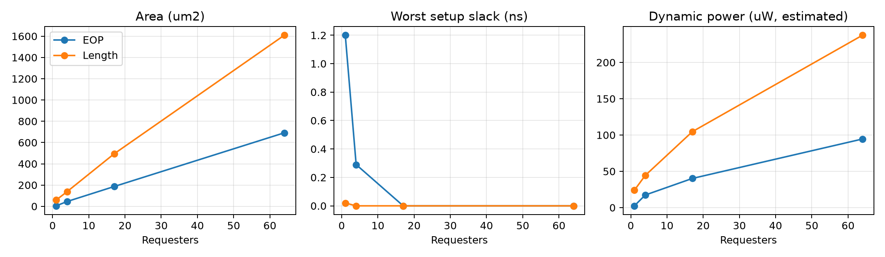

# PPA表征报告

Run `run-20260910-02`；DC V-2023.12-SP3；TT 1.00V/25C，400MHz，输入/输出延迟0.5ns、uncertainty 0.1ns、负载0.01pF。

PPA-E2工艺绑定表征，活动为输入概率0.5、toggle rate 0.1的vectorless传播估计，非实测工作负载功耗；资产成熟度独立。

| N | 模式 | LEN_W | 总面积 um² | 父级自身 | 子级合计 | 最差slack ns | reg→reg ns | 动态 µW | 漏电 nW |
|---|---|---|---|---|---|---|---|---|---|
| 17 | 0 | 8 | 186.147 | 148.239 | 37.908 | 0.000 | 0.000 | 40.168 | 26.926 |
| 17 | 1 | 8 | 493.740 | 452.790 | 40.950 | 0.000 | 0.050 | 104.612 | 87.699 |
| 1 | 0 | 8 | 4.563 | 4.563 | 0.000 | 1.200 | 2.130 | 2.441 | 0.552 |
| 1 | 1 | 8 | 59.202 | 59.202 | 0.000 | 0.020 | 0.490 | 23.984 | 7.811 |
| 4 | 0 | 8 | 45.162 | 40.482 | 4.680 | 0.290 | 0.640 | 17.345 | 5.996 |
| 4 | 1 | 1 | 49.023 | 44.343 | 4.680 | 0.260 | 0.640 | 22.616 | 6.833 |
| 4 | 1 | 16 | 269.802 | 263.718 | 6.084 | 0.000 | 0.330 | 71.894 | 49.551 |
| 4 | 1 | 8 | 137.826 | 133.146 | 4.680 | 0.000 | 0.450 | 44.338 | 20.371 |
| 64 | 0 | 8 | 691.353 | 508.014 | 183.339 | 0.000 | 0.000 | 94.540 | 115.209 |
| 64 | 1 | 8 | 1609.218 | 1404.936 | 204.282 | 0.000 | 0.000 | 237.498 | 314.076 |

本次全部10点满足所列400MHz约束。
组合输入/输出路径与reg→reg路径分别报告，未以第一条arrival替代时序结论。
部分slack显示0.000是原始DC报告的显示精度；报告状态为MET，不代表存在可外推的时序裕量，生产签核需高精度多角STA。
父级面积由total减去两个直接子实例的层级面积计算；不重复累计孙级，不将子CBB面积算作父逻辑收益。
单实现、不同请求数量提供不同容量，不能据此宣布一个容量点支配另一个；EOP与长度模式功能不同，不作等价实现Pareto优劣排行。
主要结构优化为并行优先编码、显式回绕替代取模、EOP模式裁剪计数器和N=1特化。结果不外推到未扫参数、其他工艺角或真实布线。
详设的PPA-E0推导现由本表实测补充；保存层级area/power、全路径/寄存器/输出timing、clock/check/constraints和SVF/DDC/netlist。
失败run-01由冗余current_design原始名引起，已按工具诊断拒绝，最终仅消费修复后的run-02；report_power总量从保存DDC重放，不重复综合。
原始报告留build/eda/ppa，公开摘要只含库/corner标识、输入和证据hash。
