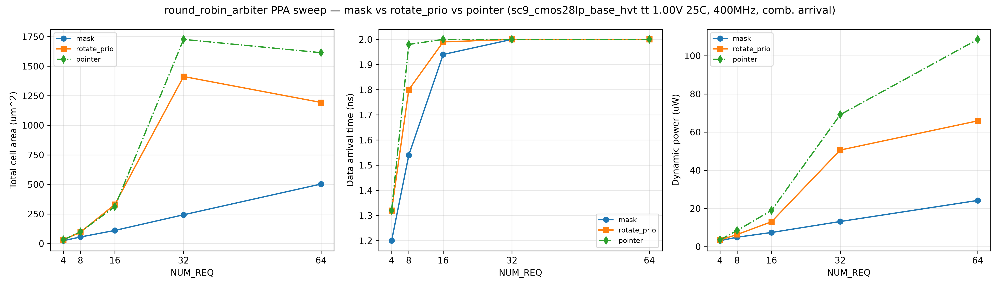

# PPA Report — round_robin_arbiter (G6)

> 证据等级：E2（DC 综合，单 corner `tt_1p00v_25c`，CMOS28LP / sc9_cmos28lp_base_hvt）。
> Run: `run-20260829-01`（15 点 = 3 实现 × 5 请求数）。库上下文：`characterization/pdk.yaml`（PDK_READY）。
> 约束：`create_clock 2.5ns`（400MHz，PDK README 建议起步）；纯组合（REQ_TYPE=0/FAST_GRANT=0/GRANT_ACK_EN=0）。

## 1. Sweep 数据

| tag | impl | N | area (µm²) | arrival (ns) | slack (ns) | dyn (µW) |
|---|---|---|---|---|---|---|
| impl0_n4  | mask | 4  | 23.87  | 1.20 | 0.80 | 3.11 |
| impl0_n8  | mask | 8  | 55.46  | 1.54 | 0.46 | 4.95 |
| impl0_n16 | mask | 16 | 110.80 | 1.94 | 0.06 | 7.42 |
| impl0_n32 | mask | 32 | 243.24 | 2.00 | 0.00 | 13.17 |
| impl0_n64 | mask | 64 | 503.33 | 2.00 | 0.00 | 24.20 |
| impl1_n4  | rotate_prio | 4  | 30.77  | 1.32 | 0.68 | 3.47 |
| impl1_n8  | rotate_prio | 8  | 96.17  | 1.80 | 0.20 | 6.38 |
| impl1_n16 | rotate_prio | 16 | 330.53 | 1.99 | 0.01 | 13.02 |
| impl1_n32 | rotate_prio | 32 | 1412.54| 2.00 | 0.00 | 50.60 |
| impl1_n64 | rotate_prio | 64 | 1193.28| 2.00 | 0.00 | 65.89 |
| impl2_n4  | pointer | 4  | 31.36  | 1.32 | 0.68 | 3.56 |
| impl2_n8  | pointer | 8  | 98.87  | 1.98 | 0.02 | 8.45 |
| impl2_n16 | pointer | 16 | 311.45 | 2.00 | 0.00 | 19.00 |
| impl2_n32 | pointer | 32 | 1726.57| 2.00 | 0.00 | 69.12 |
| impl2_n64 | pointer | 64 | 1614.13| 2.00 | 0.00 | 108.56 |

> 原始数据：`build/eda/ppa/run-20260829-01/*_summary.txt`（EDA 产物在 build/，不入库）；
> 绘图可复现：`uv run --with matplotlib python characterization/plot_ppa_comparison.py
>   --run-dir build/eda/ppa/run-20260829-01 --out reports/ppa_run-20260829-01.png`。

## 2. 结论（Pareto 观察）

- **面积**：`mask` 全 N 最小（N=64 时 503 vs rotate 1193 vs pointer 1614）——符合详设预测
  （两段链 + MUX 最小面积，无桶形移位器）。
- **时序（400MHz）**：小 N（≤8）三实现 slack 均 ≥0.2ns；N≥16 后 mask 达 2.00ns arrival（O(N) 链临界），
  rotate/pointer 同样在 2.5ns 目标内（slack 0.00~0.01，O(log N) 路径接近目标）。
- **动态功耗**：与面积强相关——`mask` 全 N 最小（N=64 时 24.2µW vs rotate 65.9 vs pointer 108.6），
  印证两段链无移位器/少组合翻转；pointer 显式移位器功耗最高。
- **面积/时序/功耗权衡**：N≤8 推荐 `mask`（`mask_area` Profile）；N≥16 若面积/功耗敏感仍选 mask
  （400MHz 可收敛），若需更高 fmax 选 `rotate_prio`（`rotate_timing` Profile）。
- **pointer** 面积/功耗最差（N≥32），与详设"显式循环移位器面积略大"预测一致；其价值在代码规整性，非 PPA。

## 3. 基线绑定

- PDK：CMOS28NM / sc9_cmos28lp_base_hvt / corner `tt_nominal_max_1p00v_25c`
- 约束：2.5ns 时钟、输入/输出 delay 0.5ns、BUFH_X4M_A9TH 驱动、0.01 负载
- 复现：`cd build/eda/ppa && PC_RTL_DIR=<rtl> PC_CBB_ROOT=<cbb> PC_RUN_ID=run-<id> dc_shell -f characterization/synth_sweep.tcl`
