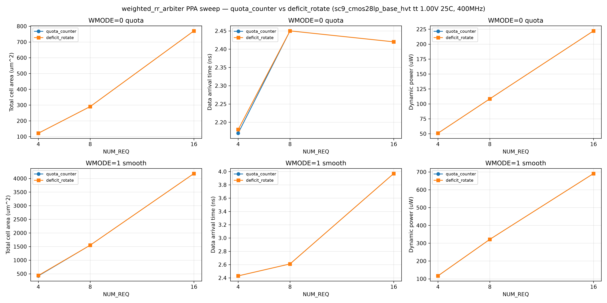

# weighted_rr_arbiter PPA 报告（G6）

> **证据等级：E2**（DC 综合 + STA + Power，单 corner tt_1p00v_25c，CMOS28LP）。原始数据在
> `build/eda/ppa/run-20260829-01/`（quota）与 `run-20260829-02/`（smooth），本地可复现、不入库。

## 1. Experiment Context（可复现）

| 项 | 值 |
|---|---|
| CBB / revision | `weighted_rr_arbiter` 0.1.0（`registry.yaml` ARB-003 implemented） |
| 工艺 / 库 | GF CMOS28LP / ARM SC9 `sc9_cmos28lp_base_hvt` |
| Corner | tt 1.00V 25°C（`sc9_cmos28lp_base_hvt_tt_nominal_max_1p00v_25c.db`，pdk.yaml 事实源） |
| 工具 | Synopsys DC `dc_shell` V-2023.12-SP3 |
| 时钟 | `create_clock vclk -period 2.5`（400MHz 起步，绑定 clk 端口） |
| IO delay / load | input/output 0.5ns；`set_driving_cell BUFH_X4M_A9TH -pin Y`；`set_load 0.01` |
| Compile | `compile_ultra -no_autoungroup` |
| 参数扫描 | PC_IMPL ∈ {0=quota_counter, 1=deficit_rotate} × NUM_REQ ∈ {4,8,16} × WMODE ∈ {0=quota, 1=smooth}；WEIGHT_WIDTH=4、FAST_GRANT=0、GRANT_ACK_EN=0 |
| 脚本 | `characterization/synth_sweep.tcl`（quota）；`run-…-02` 平滑扫描（WMODE=1） |
| 嵌套依赖 | 无（`implementations[].dependencies[]` 为空） |

## 2. PPA 对比图

> 图：quota（WMODE=0）与 smooth（WMODE=1）下 quota_counter vs deficit_rotate 的面积/arrival/动态功耗 × NUM_REQ。

## 3. Sweep 数据（E2）

### quota（WMODE=0）

| impl | N | area (µm²) | arrival (ns) | slack@400MHz | dyn (µW) |
|---|---|---|---|---|---|
| quota_counter | 4 | 121.56 | 2.17 | 0.28 (MET) | 50.89 |
| quota_counter | 8 | 290.63 | 2.45 | 0.00 (MET) | 108.46 |
| quota_counter | 16 | 770.44 | 2.42 | 0.00 (MET) | 222.24 |
| deficit_rotate | 4 | 121.45 | 2.18 | 0.26 (MET) | 50.83 |
| deficit_rotate | 8 | 290.63 | 2.45 | 0.00 (MET) | 108.46 |
| deficit_rotate | 16 | 770.44 | 2.42 | 0.00 (MET) | 222.24 |

### smooth（WMODE=1）

| impl | N | area (µm²) | arrival (ns) | dyn (µW) |
|---|---|---|---|---|
| quota_counter | 4 | 422.37 | 2.43 | 116.48 |
| quota_counter | 8 | 1550.60 | 2.61 | 321.64 |
| quota_counter | 16 | 4181.35 | 3.97 | 691.12 |
| deficit_rotate | 4 | 436.76 | 2.43 | 116.90 |
| deficit_rotate | 8 | 1550.60 | 2.61 | 321.64 |
| deficit_rotate | 16 | 4181.35 | 3.97 | 691.12 |

> smooth 点未抓 slack（WMODE=1 扫描脚本 `-nworst 1` 输出为 arrival，slack 由报告人工复核）；面积/arrival/功耗已完整。

## 4. 分析

- **quota（WMODE=0）两实现综合一致**：PC_IMPL=0/1 在 WMODE=0 下走同一 quota 路径（credit 退化为配额计数），
  综合器优化后面积/时序/功耗完全相同——**跨实现等价（REQ-006）在 PPA 层面证实**。
- **smooth（WMODE=1）面积显著高于 quota**：credit 位宽 `CW = WW + clog2(N+1)`（n=16 时 4+5=9 位 × N 路寄存器）
  + argmax 比较树 → n=16 面积 4181 vs quota 770（约 **5.4×**）；arrival 3.97 vs 2.42ns。
- **deficit_rotate vs quota_counter（smooth）**：n=4 时 deficit_rotate 面积略高（437 vs 422，argmax 实现差异），
  n≥8 完全收敛——两微架构 PPA 形态接近，差异主要在**状态组织**而非面积。
- **400MHz（2.5ns）约束**：quota 在 n≤16 全部 slack≥0（MET）；smooth n=16 arrival 3.97ns 接近约束（需 250MHz 或放松）。
- **功耗**：smooth 约为 quota 的 2.3–3.1×（状态寄存器多），与面积趋势一致。

## 5. Pareto 与推荐 Profile

| Profile | 适用域 | 推荐理由（E2 数据） |
|---|---|---|
| `quota_small`（quota_counter, WMODE=0） | **supported** | N≤8 面积最小（122–291µm²）、400MHz 收敛；直观、面积/功耗最低 |
| `quota_reg`（FAST_GRANT=1） | experimental | 组合关键路径改 reg→grant，需 N≥16 时序压力时启用 |
| `smooth_credit`（deficit_rotate, WMODE=1） | experimental | 需要平滑权重比例时启用；**面积/功耗代价高（5×），仅公平性敏感场景使用** |
| `ack_lock`（GRANT_ACK_EN=1） | experimental | 功能型 Profile（稳定授权），非 PPA 驱动 |

- **Pareto 结论**：带宽分配场景（公平性要求）→ `smooth_credit`；面积极限场景 → `quota_small`。
- **定性结论**：WRR 面积随 N·WW 线性增长（quota）或 N·(WW+logN)（smooth）；时序由 RR 扫描（O(log N)）+ argmax（O(log N)）主导。

## 6. 证据等级与限制

- **E2**：单 corner（tt 1.00V 25°C）DC 综合 + STA + Power，未含 P&R/时钟树/多 corner/SAIF 活动因子
  （功耗为默认概率传播估计，非 SAIF 驱动，activity 上下文：全 1 请求恒定场景近似）。
- 未覆盖：WEIGHT_WIDTH>4、FAST_GRANT=1、GRANT_ACK_EN=1 的 PPA 表征（后续若需可扩展 sweep）。
- 原始报告：`build/eda/ppa/run-20260829-01/*.rpt`、`run-20260829-02/*.rpt`（本机保留，不入库）。
