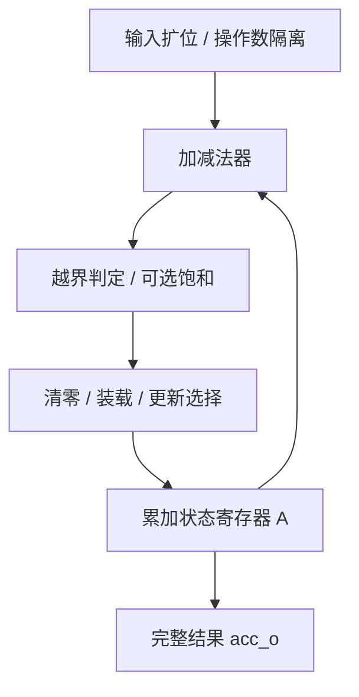

# accumulator 架构设计（C2）

> 本文件为 C2 架构论证视图；SSOT 为 [`cbb.yaml`](../cbb.yaml)（+[`behavior.yaml`](../behavior.yaml)），
> 多实现 Profile 见 [`profiles.yaml`](../profiles.yaml)。本文件不替代机器契约。

## 1. 模块划分

- **抽象粒度**：A2（参数化数据通路构件，带状态）；技术域 `arithmetic_datapath`。
- **顶层**：单公开模块 `accumulator`，极简单文件 [`rtl/accumulator.sv`](../rtl/accumulator.sv)（不引入 package/interface）。
- **内部结构（功能视图，非强制模块边界）**：

- 功能图不强制每个框对应独立模块；综合器可合并选择逻辑、共享加减法和优化饱和判定（对应调研 §6.1）。
- **V1.0 单实现**（`impl_single_entry`）：行为 RTL 表达递推语义，让综合器映射算术结构；不手写 carry-save/偏斜流水等增强结构。

## 2. 多实现划分与生成方式决策

| 候选 | 决策 | 理由 |
|---|---|---|
| 原生 `A±X` + CE（NATIVE） | **SV 手写（V1.0 基线）** | 递推语义可用行为 SV 简洁表达，综合器负责算术映射；基础核不引入 Python 生成 |
| ripple / carry-select / prefix | 设计选项（PPA-02） | 作为候选在 G6 同条件对比，不预先手写（允许综合器先优化） |
| 操作数隔离（PPA-04） | 参数化开关（OPERAND_ISOLATION） | 用组合使能条件屏蔽无效算术输入，直接等价 |
| 跨位段偏斜流水（PPA-07） | **非 V1.0** | 延迟合同变化，需独立 profile 与状态映射证明 |
| carry-save 冗余反馈（PPA-08） | **非 V1.0** | 默认不满足全功能逐拍合同（signed overflow/sticky/SATURATE 无法仅凭 W 位公式恢复） |
| 多状态交织/分条（PPA-09） | **非 V1.0** | 任务与观察合同变化，独立增强探索 |

**生成方式**：V1.0 基础核只输出参数/工程文件（FuseSoC），无需生成大量 SV；增强后端真正需要结构生成时再引入能表达状态反馈的 IR/Graph（调研 §9）。SV 简洁表达优先。

## 3. 时钟复位与错误模型

| 项 | 契约 |
|---|---|
| 时钟 | 单时钟 `clk_i`（上升沿），1 个时钟域 |
| 复位 | 低有效同步复位 `rst_ni`：清状态 A 及所有状态/事件输出 |
| 控制优先级 | rst_ni > clear_i > ce_i=0 > LOAD（LOAD_EN=1 且 load_i=1）> valid_i > 保持（ACC-CTL-001） |
| 事件重赋值 | update_o / overflow_event_o 每根时钟沿重新赋值，无事件时为 0（不因 ce_i=0 保持高） |
| sticky 清除 | 复位/CLR/LOAD 清零；新溢出置 1（同拍优先于 status_clear_i）；否则 status_clear_i 清 0；否则保持（ACC-CTL-003） |
| X 语义 | 输入 X/Z 不承诺（ASM-001）；参数为编译期（ASM-002） |
| 时钟门控 | 算术核心保持工艺无关，禁止 `gclk=clk & enable` 任意组合门控；ICG 用已验证工艺 wrapper（调研 §7.3） |

## 4. 反馈路径与门控论证

- **核心 A→A 反馈**：`A[n+1] = f(A[n], X[n])`，单拍组合路径（进位传播 + 饱和判定/选择 + 控制扇出）。输出端追加寄存器不能缩短核心反馈；不能仅改 LATENCY 参数沿用原接口承诺（调研 §6.2）。
- **操作数隔离**：`arith_accept = rst_ni && !clear_i && ce_i && !(LOAD_EN && load_i) && valid_i`（调研 §7.2）仅作组合使能条件，不直接与时钟相与；隔离可降低 idle 时 data_i 翻转的功耗，但满吞吐下 MUX 可能增加面积/延迟，默认关闭并实测后选择。
- **ICG 分组**：A 银行时钟请求覆盖同步复位/CLR/LOAD/算术更新；sticky 银行还需覆盖 status_clear_i；update/event 银行在无事件时仍需时钟清零（不能跟随 A 银行关钟而把脉冲保持多周期）。同步复位必须能打开门控。test_enable 只用于已验证门控 primitive 测试旁路。
- **可验证性**：时序等价不变量——无操作则 A 保持；CLR 后 A=0；有效 ADD/SUB 符合精确参考；操作数隔离/门控开关不改变根时钟采样结果（对应 INV-001/004/005、PROP-ACC_EQV-007）。

## 5. Profile 与验证路径

| Profile | 参数意图 | 优化目标 | 验证路径 |
|---|---|---|---|
| prof_default | 16/32/signed/ADD/WRAP/LOAD/STATUS | balanced | 全测试用例 + formal |
| prof_area_opt | 8/16/signed/ADD/WRAP/无LOAD | area | 穷举/边界 + formal |
| prof_power_opt | 16/32/signed/ADD_SUB/隔离 | power | 随机 + 隔离等价 |
| prof_saturating | 16/32/signed/ADD_SUB/SATURATE | correctness_bound | 边界/饱和恢复 + formal |
| prof_nco | 16/32/unsigned/ADD/WRAP/无状态 | balanced | 回绕边界 + formal |

每个 Profile 均绑定 `impl_single_entry`，验证共享同一参考模型与断言（simulation + formal，stateful 族）。Profile 支持状态在 G6 表征后回填（当前 experimental）。

## 6. 可验证性论证（G2）

- **stateful 族焦点**：状态不变量（INV-001/002/003）、复位契约（INV-005）、连续流量（INV-004）。
- **参考模型**：独立无限精度整数算术，逐步执行状态与控制优先级（ACC-VER-001）；穷举小位宽、随机序列、连续前缀和（ACC-VER-002/007）。
- **属性**：PROP-ACC_CORRECT-001 / NUM-002 / OVERFLOW-003 / TIMING-004 / RESET-005 / EQV-007，落地于 plan.yaml 与 SVA。
- **反例保留**：饱和重排反例（8 位 signed，100+100−100：逐步饱和=27，先求和再饱和=100）必须保持不等价预期（ACC-VER-010）。
- **负向**：非法参数 elaboration $error 拦截（REQ-006），不以工具崩溃代替诊断。

## 7. 综合器 / 架构 / 脚本分工

- 综合器：算术映射、常量与静态模式裁剪、MUX 合并、缓冲/驱动优化、合法约束下门控插入。
- 架构/RTL：递推语义、II、状态更新顺序、溢出/饱和、同步复位与门控、跨周期依赖。
- 脚本：参数检查、区间/位宽分析、批量生成配置、调用 FuseSoC/EDA、统一 PPA 约束、结果对比（调研 §9）。
