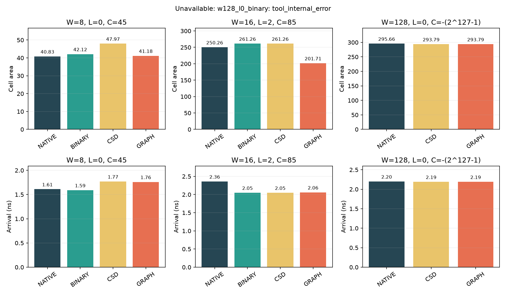

# 固定库综合对比

结果等级：synthesized（未完成点单列）；固定库指纹见 ppa-results.json。工艺角 tt_nominal_max_1p00v_25c，DC V-2023.12-SP3，周期 2.5 ns，I/O 各 0.25 ns、负载 0.01 pF、转换时间 0.05 ns、不确定度 0.05 ns。组合模式使用虚拟时钟。

仅比较同组相同位宽、系数、精度和延迟；未运行布局布线。功耗来自默认活动估计，无门级活动及样本窗口，不能证明毛刺收益或每有效样本能量。

| 配置组 | 实现 | 单元面积 | 到达时间 ns | 最差 slack ns | 动态功耗 W（估计） | 泄漏 W（估计） |
|---|---|---:|---:|---:|---:|---:|
| W8/L0 | NATIVE | 40.833 | 1.61 | 0.59 | 1.83142e-05 | 8.3706e-09 |
| W8/L0 | BINARY | 42.12 | 1.59 | 0.61 | 1.8627e-05 | 8.7158e-09 |
| W8/L0 | CSD | 47.97 | 1.77 | 0.43 | 1.97242e-05 | 8.5524e-09 |
| W8/L0 | ADDER_GRAPH | 41.184 | 1.76 | 0.44 | 1.85582e-05 | 7.9005e-09 |
| W16/L2 | NATIVE | 250.263 | 2.36 | 0.01 | 0.00013206 | 3.90063e-08 |
| W16/L2 | BINARY | 261.261 | 2.05 | 0.35 | 0.00013907 | 4.14204e-08 |
| W16/L2 | CSD | 261.261 | 2.05 | 0.35 | 0.00013907 | 4.14204e-08 |
| W16/L2 | ADDER_GRAPH | 201.708 | 2.06 | 0.34 | 0.000104209 | 3.39545e-08 |
| W128/L0 | NATIVE | 295.659 | 2.2 | 0 | 4.68907e-05 | 5.37167e-08 |
| W128/L0 | BINARY (tool_internal_error; system_out_of_memory) | unavailable | unavailable | unavailable | unavailable | unavailable |
| W128/L0 | CSD | 293.787 | 2.19 | 0.01 | 4.63797e-05 | 5.1286e-08 |
| W128/L0 | ADDER_GRAPH | 293.787 | 2.19 | 0.01 | 4.63797e-05 | 5.1286e-08 |

失败原因已核实：内核 OOM 日志与 DC 异常退出子进程 PID 156845 一致，被杀进程匿名驻留内存为 10430936 KiB。系统内存耗尽后 DC 报告 tool_internal_error；该点未生成 PPA 指标。证据指纹见 [诊断记录](ppa-failure-diagnosis.json)。

降低 datapath 优化等级的隔离重试通过了算术映射阶段，但随后优化阶段仍耗尽内存；该重试设置单进程 7 GiB 虚拟内存上限，工具明确报告 Out of memory。

传统 `compile -map_effort medium` 重试在映射优化阶段按用户收尾要求终止，状态为 cancelled，未产生可用 PPA 结果；不能据此判定该流程成功或失败。

TNS、最大扇出及物理布线指标当前 unavailable；触发器与 buffer 数从所选库的单元类型抽取到 JSON，不以 0 代替。到达时间包含 I/O 条件；流水配置报告保留全部适用路径，不能把不同延迟跨组比较为收益。

约束报告中的 max_leakage_power=0 是工具默认泄漏优化目标，其 VIOLATED 不属于 setup 失败，不作为已批准功耗上限。

AUTO 仍回退 NATIVE：该代表矩阵不构成所有配置的可信工艺缓存。面积、延迟未指定数值选择上限，保留候选，无唯一最优宣称。

