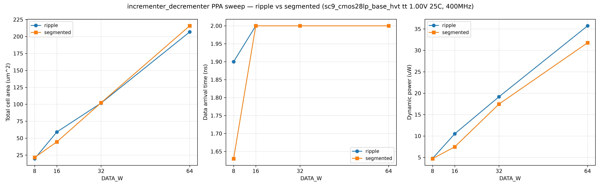
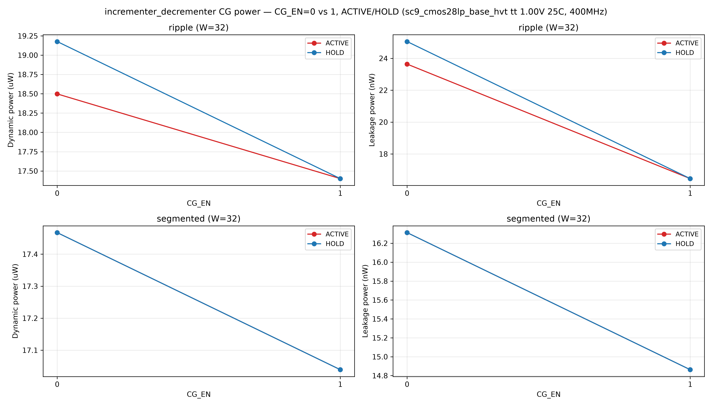

# incrementer_decrementer PPA 报告（G6）

> 工艺：sc9_cmos28lp_base_hvt（GF 28nm LP，tt_1p00v_25c）；DC compile_ultra -no_autoungroup
> 约束：create_clock 2.5ns（400MHz），input/output delay 0.5ns，BUFH_X4M_A9TH 驱动，0.01pF 负载
> 证据：`build/eda/ppa/run-20260829-01/`（16 点全完成，DC_EXIT=0）；CG 功耗对比 `run-20260829-02/`
> 数据来自 `*_summary.txt`

## 1. 结果矩阵

| 实现 | W | SEG_W | 面积 (μm²) | arrival (ns) | slack (ns) | dyn (uW) | leak (nW) |
|---|---|---|---|---|---|---|---|
| ripple | 8 | 4/8 | 19.77 | 1.90 | 0.10 | 4.77 | 2.34 |
| ripple | 16 | 4/8 | 59.09 | 2.00 | 0.00 | 10.51 | 9.46 |
| ripple | 32 | 4/8 | 101.79 | 2.00 | 0.00 | 19.18 | 25.05 |
| ripple | 64 | 4/8 | 206.74 | 2.00 | 0.00 | 35.73 | 40.78 |
| segmented | 8 | 4 | 21.53 | **1.63** | 0.37 | 4.72 | 2.51 |
| segmented | 8 | 8 | 22.23 | 1.76 | 0.24 | 5.19 | 2.61 |
| segmented | 16 | 4 | **44.46** | 2.00 | 0.00 | 7.47 | 6.01 |
| segmented | 16 | 8 | 49.37 | 1.99 | 0.01 | 8.23 | 6.24 |
| segmented | 32 | 4 | 105.88 | 2.00 | 0.00 | 16.96 | 20.53 |
| segmented | 32 | 8 | 102.26 | 2.00 | 0.00 | 17.47 | 16.31 |
| segmented | 64 | 4 | 215.75 | 2.00 | 0.00 | 31.78 | 33.17 |
| segmented | 64 | 8 | 216.57 | 2.00 | 0.00 | 34.01 | 34.21 |

> ripple 的 SEG_W 参数不生效（忽略），故 seg4/seg8 数据相同。



## 2. 观察

- **窄位宽（W=8）**：segmented 时序显著优于 ripple（1.63 vs 1.90ns，+0.27ns slack 余量）；
  面积略增（21.5 vs 19.8μm²，+9%）。timing 优先场景推荐 segmented。
- **W=16**：segmented(SEG4) 面积最小（44.5μm²，比 ripple 59.1 小 25%）且时序等价 → 面积/时序双优。
- **W=32/64**：两实现均达 400MHz 约束（slack 0.00，arrival 2.00ns），面积接近；
  segmented(SEG8) 在 W=32 面积略优（102.3 vs 101.8 基本持平）、leak 更小（16.3 vs 25.1nW）。
- **宽位宽时序**：DC 在 compile_ultra 下对简单半加器链做了等价树优化，ripple 与 segmented
  在 400MHz 下均收敛；两者差异主要体现在窄位宽/面积。与详设预期一致。

## 3. Profile 推荐（回填 profiles.yaml）

| Profile | 推荐 | 依据 |
|---|---|---|
| prof_timing_opt | segmented (SEG=4) | W=8 arrival 1.63ns 最短、slack 余量最大 |
| prof_area_opt | segmented (SEG=4) | W=16 面积 44.5μm² 最小 |
| prof_balanced / prof_reference | ripple | 窄位宽时序足够 + 面积最直观 |
平）、leak 更小（16.3 vs 25.1nW）。
宽位宽时序：DC 在 compile_ultra 下对简单半加器链做了等价树优化，ripple 与 segmented 在 400MHz 下均收敛；两者差异主要体现在窄位宽/面积。与详设预期一致。


- **证据等级**：E1（真实综合、tt 单 corner、固定约束/seed 可复现）。
- **局限**：ss/ff corner 未跑（计划后续 Gate）；功耗为静态 toggle 估计（未翻转率约束）；
  消费者 smoke 未做。G6 结论为 **candidate**，需 G7 支持矩阵确认后晋升。

## 5. CG（Carry/Data Gating）功耗对比

> 自动 CG（CG_EN=1）基于已有 `inc_en/dec_en` 门控进位链与 XOR（无外部 en 端口）；
> 纯组合，无需 ICG（时钟门控）专用器件——ICG 仅适用于时序电路的时钟路径（下游 Counter 范畴）。
> 数据：`build/eda/ppa/run-20260829-02/`（W=32 代表点，ACTIVE/HOLD 两翻转率场景，DC report_power）

| 实现 | CG_EN | 场景 | dyn (uW) | leak (nW) | 备注 |
|---|---|---|---|---|---|
| ripple | 0 | ACTIVE | 18.50 | 23.64 | 原始结构基线 |
| ripple | 0 | HOLD | 19.18 | 25.05 | din 高翻转但 inc/dec 恒定 |
| ripple | 1 | ACTIVE | **17.40** | **16.45** | CG 门控，-6% dyn / -30% leak |
| ripple | 1 | HOLD | **17.40** | **16.45** | 门控后 HOLD 与 ACTIVE 一致 |
| segmented | 0 | ACTIVE | 17.47 | 16.31 | 原始结构基线 |
| segmented | 0 | HOLD | 17.47 | 16.31 | carry-skip 天然低翻转 |
| segmented | 1 | ACTIVE | **17.04** | **14.86** | CG 门控，-2.5% dyn / -9% leak |
| segmented | 1 | HOLD | **17.04** | **14.86** | 门控后 HOLD 与 ACTIVE 一致 |



**观察与结论**
- **leak 收益显著**：ripple CG=1 漏电 -30%（25.05→16.45nW）；segmented -9%。
  门控边界使综合器消掉 hold 模式不工作的冗余进位逻辑，面积/漏电下降。
- **dyn 收益 modest**：ripple -6%、segmented -2.5%。纯组合下 dout 在 HOLD 仍须直通
  din（契约 dout=din），din→输出路径翻转不可避免；CG 收益主要来自进位链与
  carry-skip 内部节点零翻转 + 门控单元裁剪。
- **HOLD 与 ACTIVE 趋同（CG=1）**：门控后进位链在 HOLD 不翻转，功耗主要由 din→dout
  直通贡献，故两场景接近；说明 CG 消除了"hold 时多余运算"。
- **无需 ICG 器件**：数据通路门控用普通组合门（AND/XOR），DC 映射为标准单元；
  若需对下游 Counter 寄存器做时钟门控（真正的 ICG），属调用方 Counter 的设计范畴。

## 6. 复现

### 主 Sweep（面积/时序）
```bash
export IDE_CBB_ROOT=<cbb_root> IDE_RTL_DIR=<cbb_root>/rtl IDE_RUN_ID=run-20260829-01
dc_shell -f characterization/synth_sweep.tcl
```

### CG 功耗对比
```bash
export IDE_CBB_ROOT=<cbb_root> IDE_RTL_DIR=<cbb_root>/rtl IDE_RUN_ID=run-20260829-02
dc_shell -f characterization/synth_power_cg.tcl
```
