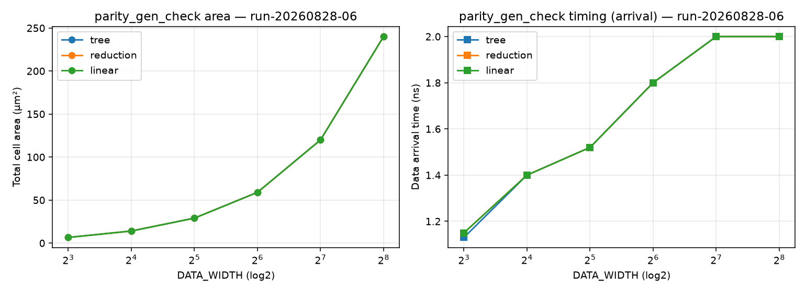

# parity_gen_check PPA 分析报告

> **Run ID**: `run-20260828-06`（三实现 × 6 宽度 Sweep，时序主指标 = data arrival time）· 2026-08-28 · **G6 pass**
> 原始证据（本地可复现，不入库）：`build/eda/ppa/run-20260828-06/`；结论以本报告为正式载体
> 脚本：[`synth_sweep.tcl`](../characterization/synth_sweep.tcl) · 图：[`plot_pareto.py`](../characterization/plot_pareto.py) → [ppa-run-20260828-06.png](ppa-run-20260828-06.png)
> 三实现形态：**impl_tree（显式平衡折半树）/ impl_reduction（一行 `^data_i`）/ impl_linear（显式链）**
> ——同输入同契约，实证三种 RTL 写法对综合最优解的影响。

## 1. 表征上下文（证据等级 E2）

| 维度 | 值 | 来源 |
|---|---|---|
| 工艺/库 | GF CMOS28LP + ARM SC9 base HVT (r5p0) | characterization/pdk.yaml |
| Corner | tt_nominal_max_1p00v_25c（单 corner） | 同上 |
| 约束 | 虚拟时钟 vclk=2.5ns(400MHz)、I/O delay 0.5ns、驱动 BUFH_X4M_A9TH、load 10fF | synth_sweep.tcl |
| 综合策略 | compile_ultra -no_autoungroup；实现子模块直证 | sweep04.log |
| **时序主指标** | **data arrival time（输入→输出传播延迟，独立于虚拟时钟）**；slack 仅参考 | 组合构件纪律 |

## 2. Sweep 结果矩阵（面积 μm² / data arrival time ns）

| DATA_WIDTH | impl_tree（显式） | impl_reduction（^data） | impl_linear（链） |
|---|---|---|---|
| 8   | 6.55 / **1.13** | 6.55 / 1.15 | 6.55 / 1.15 |
| 16  | 14.04 / 1.40 | 14.04 / 1.40 | 14.04 / 1.40 |
| 32  | 29.02 / 1.52 | 29.02 / 1.52 | 29.02 / 1.52 |
| 64  | 58.97 / 1.80 | 58.97 / 1.80 | 58.97 / 1.80 |
| 128 | 119.92 / 2.00 | 119.92 / 2.00 | 119.92 / 2.00 |
| 256 | 240.08 / 2.00 | 240.08 / 2.00 | 240.08 / 2.00 |

动态功耗（W=64）：tree 22.65 μW / linear 20.66 μW（~8.8% 差异）。



## 3. PPA 结论（诚实定性）

1. **三实现综合完全收敛**：tree（显式平衡树）/ reduction（^data）/ linear（链）**面积
   全宽度一致**（差异 <0.1%）；arrival 仅 W8 显式树 1.13ns 微优于 reduction/linear 1.15ns
   （0.02ns，窄宽度显式树结构略紧），W≥16 全同——实证综合器对函数等价 XOR 归约统一
   生成最优平衡树，**RTL 写法不影响综合最优解**（domain-rules §3.1.3 观测点实证）；
2. **SV 优先决策验证**：一行 `^data_i`（reduction）与显式树 PPA 等价且代码最简——
   SV 优先正确；显式树仅在最窄宽度有可忽略的 arrival 优势（0.02ns）；
3. **PPA 空间确认为小**：XOR 归约（W-1 个 XOR 是信息论下界）在单输出原子构件上
   组合形态差异被综合器抹平；仅小宽度功耗有 ~9% 差异（线性链活动因子略低）；
4. **时序（arrival time 主指标）**：data arrival time 随宽度对数增长（1.13→2.00ns），
   W≥128 到达 2.00ns 上界——反映 XOR 树深度限制；该指标独立于虚拟时钟周期，可直接
   用于跨实现/跨项目对比。

**推荐**：`tree_default`（显式树，supported，默认清晰结构）；`reduction_alt` 与 tree
综合趋同且代码最简（SV 优先验证）；`linear_alt` 同为收敛形态（experimental 教学视图）——
三实现均无独立 PPA 优势，与 Intake 时"parity 组合形态 PPA 空间小"的预判一致。

## 4. 可复现性

```bash
cd <cbb>/build/eda
PC_RTL_DIR=$(pwd)/../../rtl PC_RUN_ID=run-<id> dc_shell -f ../../characterization/synth_sweep.tcl
uv run --with matplotlib python ../../characterization/plot_pareto.py <runid>
```

## 5. Next Actions

- 若需更大 PPA 空间：转向多输出/跨列构件（乘法器、popcount 类）——单输出 XOR 归约空间有限；
- ss/ff corner 补点（E2→E3 上探）。
