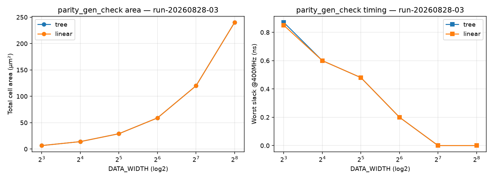

# parity_gen_check PPA 分析报告

> **Run ID**: `run-20260828-03`（双实现 × 6 宽度 Sweep）· 2026-08-28 · **G6 pass**
> 原始证据（本地可复现，不入库）：`build/eda/ppa/run-20260828-03/`；结论以本报告为正式载体
> 脚本：[`synth_sweep.tcl`](../characterization/synth_sweep.tcl) · 图：[`plot_pareto.py`](../characterization/plot_pareto.py) → [ppa-run-20260828-03.png](ppa-run-20260828-03.png)

## 1. 表征上下文（证据等级 E2）

| 维度 | 值 | 来源 |
|---|---|---|
| 工艺/库 | GF CMOS28LP + ARM SC9 base HVT (r5p0) | characterization/pdk.yaml |
| Corner | tt_nominal_max_1p00v_25c（单 corner） | 同上 |
| 约束 | 虚拟时钟 vclk=2.5ns(400MHz)、I/O delay 0.5ns、驱动 BUFH_X4M_A9TH、load 10fF | synth_sweep.tcl |
| 综合策略 | compile_ultra -no_autoungroup；实现子模块直证 | sweep03.log |

## 2. Sweep 结果矩阵（面积 μm² / worst slack ns @400MHz）

| DATA_WIDTH | impl_tree | impl_linear |
|---|---|---|
| 8   | 6.55 / +0.87 | 6.55 / +0.85 |
| 16  | 14.04 / +0.60 | 14.04 / +0.60 |
| 32  | 29.02 / +0.48 | 29.02 / +0.48 |
| 64  | 58.97 / +0.20 | 58.97 / +0.20 |
| 128 | 119.92 / 0.00 | 119.92 / 0.00 |
| 256 | 240.08 / 0.00 | 240.08 / 0.00 |

动态功耗（W=64）：tree 22.65 μW / linear 20.66 μW（~8.8% 差异，线性链翻转较少）。



## 3. PPA 结论（诚实定性）

1. **tree 与 linear 综合后完全收敛**：所有宽度面积一致（差异 <0.1%），slack 一致——
   DC 将线性 XOR 链自动重排为平衡归约树（domain-rules §3.1.3 观测点实证）；
2. **PPA 空间确认为小**：XOR 归约（W-1 个 XOR 是信息论下界）在单输出原子构件上
   组合形态差异被综合器抹平；仅小宽度功耗有 ~9% 差异（线性链活动因子略低）；
3. **时序边际**：W≥128 时 slack=0.00（400MHz 边际），大宽度受 XOR 树深度限制。

**推荐**：`tree_default`（supported）；`linear_alt` 与 tree 综合趋同，保留为结构教学视图
（experimental），无独立 PPA 价值——与 Intake 时"parity 组合形态 PPA 空间小"的预判一致。

## 4. 可复现性

```bash
cd <cbb>/build/eda
PC_RTL_DIR=$(pwd)/../../rtl PC_RUN_ID=run-<id> dc_shell -f ../../characterization/synth_sweep.tcl
uv run --with matplotlib python ../../characterization/plot_pareto.py <runid>
```

## 5. Next Actions

- 若需更大 PPA 空间：转向多输出/跨列构件（乘法器、popcount 类）——单输出 XOR 归约空间有限；
- ss/ff corner 补点（E2→E3 上探）。
