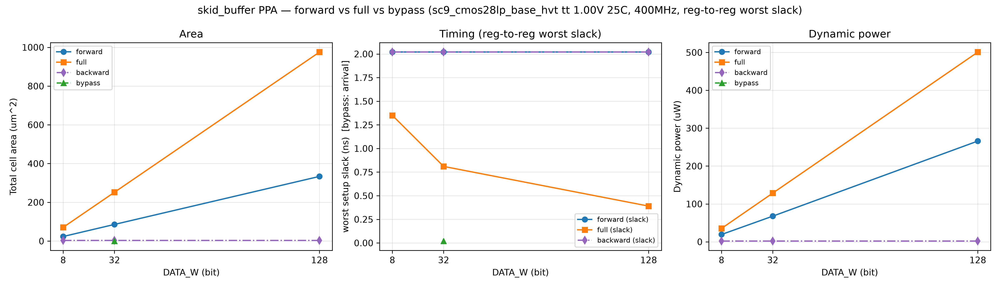

# PPA Report — skid_buffer（QUE-007, A3, 多实现 profile）

## 上下文（证据等级 E2：真实综合 + 标准单元库）

| 项 | 值 |
|---|---|
| 工艺 / 库 | GF CMOS28LP 28nm + ARM SC9（`sc9_cmos28lp_base_hvt`） |
| corner | `tt_nominal_max_1p00v_25c` |
| 约束 | 400MHz（`create_clock 2.5` 绑定 `clk` 端口） |
| 工具 | `dc_shell`（`compile_ultra -no_autoungroup`） |
| run | `run-20260829-03`（完整报告集 `build/eda/ppa/run-20260829-03/`；指标由 [`characterization/extract_ppa.py`](../characterization/extract_ppa.py) 抽取，可复现不重复综合） |
| 实现 | `impl_forward`（IMPL=0）/ `impl_full`（IMPL=1）/ `impl_backward`（IMPL=2）/ `BYPASS` |

## 结果（时序主判据：forward/full/backward = reg→reg/reg→out 最差 slack；BYPASS = 组合 arrival）

| mode | DATA_W | area(µm²) | regs | worst_slack(ns) | slack_status | io_arrival(ns) | verdict | dyn(µW) | leak(nW) |
|---|---|---|---|---|---|---|---|---|---|
| forward | 8  | 23.52 | 9  | 2.02 | MET | 0.02 | **PASS** | 19.3  | 3.7 |
| forward | 32 | 85.76 | 33 | 2.02 | MET | 0.02 | **PASS** | 67.8  | 10.8 |
| forward | 128| 333.68 | 129| 2.02 | MET | 0.02 | **PASS** | 266.0 | 42.1 |
| full | 8  | 70.90 | 18 | 1.35 | MET | 0.65 | **PASS** | 35.4  | 8.1 |
| full | 32 | 251.90 | 66 | 0.81 | MET | 0.65 | **PASS** | 128.7 | 27.7 |
| full | 128| 975.43 | 258| 0.39 | MET | 0.68 | **PASS** | 500.9 | 107.4 |
| backward | 8/32/128 | **3.39** | 1 | 2.02 | MET | 0.28 | **PASS** | **2.0** | n/a |
| bypass | 32| ~0 (wire) | 0 | —(组合) | MET | 0.02 | **PASS** | n/a | n/a |

## 多实现对比（Pareto）

- **面积**：**backward（3.39 µm²，1 FF）< forward（≈full 的 1/3）< full**——
  backward 仅 1 个 `in_ready_r` FF + 透传 wire，面积/功耗最低；full 多 SKID 槽 + DATA_W 宽 mux；
- **时序**：forward/backward worst_slack 恒 2.02ns（backward 仅 reg→out 路径，无 reg→reg）；
  full 随 `DATA_W` slack 下降（W128 最紧 0.39ns，mux 扇出）；均 400MHz MET；
- **backward 定位**：**ready 路径寄存（切反压组合链）**、valid/data 透传（0 数据延迟）——
  反压路径时序瓶颈、面积/功耗极敏感场景；代价：无缓冲槽，背压恢复 1 拍气泡；
- **功耗**：backward（2.0 µW，1 FF）<< forward（67.8 µW）< full（128.7 µW）@W32；
- **选择建议**：反压链时序瓶颈/面积功耗极限 → `backward`；面积/浅流水 → `forward`；
  满吞吐 + 深流水背压频繁 → `full`；零延迟旁路 → `BYPASS=1`；
- vs `STR-005 backward_register_slice`：本 backward 实现即其标准形式（ready registered）。

## 说明

- IO arrival（组合输出 `reg→out`）仅作参考，不作为时序结论；
- 违规只看 vclk slack 的 VIOLATED（`report_constraint` 的 leakage power slack 属功耗、非时序）；
- 完整原始报告保留在 `build/eda/ppa/run-20260829-03/` 供人查看。
