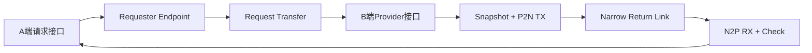
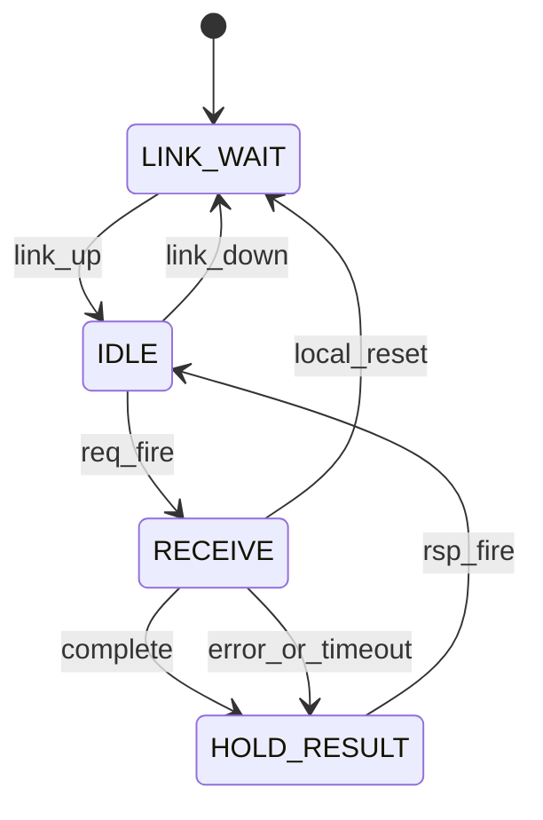
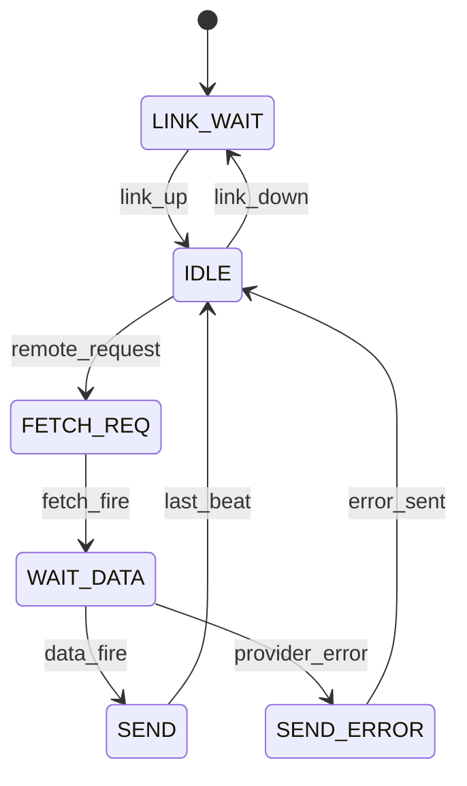

# parallel_data_fetch 需求合同

本文是现有工程 YAML 的可读需求视图，参数/行为以所链接源文件为准。本文不引入新实现要求、
不更新 Gate，也不把历史验证推广到全部配置。需求意图原文见文末附录 A（G0 输入，未冻结）。

| 字段 | 内容 |
|---|---|
| 索引 ID | INT-001 |
| 资产版本 | 0.1.0 |
| 分类/路径 | components/interconnect / components/interconnect/parallel_data_fetch |
| 功能家族 | Parallel Data Fetch |
| 优先级 | P2 |
| 当前登记状态 | planned |

## 1. 定位与使用场景

单次请求的远端宽数据原子快照经窄链路连续回传并在请求端重组，以传输时延换取长距布线资源。

需求焦点：请求端 A 发起一次 fetch，数据端 B 原子锁存一份 `DATA_WIDTH` 并行数据后按
`LINK_WIDTH` 连续多拍发送，A 端收齐后以 ready/valid 交付完整并行结果；同步与异步时钟域
使用完全相同的 A/B 业务接口。

边界焦点：不承担地址选择、标准总线协议（AXI/APB）、连续流传输、多 outstanding、多 lane、
packet、credit、路由、QoS、CRC 重传、软件寄存器、PLL/CDR 与芯片间 PHY。

拟复用场景：安全模块按请求读取远端宽密钥派生/随机数块；DFX 模块读取远端计数器与 trace entry；
调度器读取远端描述符与资源状态；低占空比宽数据跨越 SoC 较远物理区域。这些是需求场景，
不表示已有消费者依赖或完成集成。

## 2. 接口与配置需求

接口角色：A 端请求（`a_req_valid_i`/`a_req_ready_o`）与结果（`a_rsp_valid_o`/`a_rsp_ready_i`/
`a_rsp_data_o`/`a_rsp_error_o`/`a_rsp_error_code_o`）；B 端取数（`b_fetch_valid_o`/`b_fetch_ready_i`）
与数据快照（`b_data_valid_i`/`b_data_ready_o`/`b_data_i`）；端点间窄链路（请求方向单 bit
事件切片与 alive 指示；返回方向 valid/data/last/error/parity/epoch bundle，不设 ready）。
只要求实现本核实际需要的角色，不为目录分类添加空接口。

配置合法域：`DATA_WIDTH >= LINK_WIDTH`、`DATA_WIDTH % LINK_WIDTH == 0`、`RSP_FIFO_DEPTH`
为不小于 2 的 2 的幂、`ASYNC_MODE=1` 时 `REQ_SYNC_STAGES>=2` 且 `RSP_FIFO_DEPTH>=BEAT_COUNT`、
`TIMEOUT_EN=1` 时 `TIMEOUT_CYCLES > BEAT_COUNT`。数学合法域不代表无限规模均可实现；
G1 必须在有限支持集合中给出默认、最小、最大和非法组合，最大支持配置需通过展开与验证。

候选实现：切片结构 shift/indexed/banked（PPA 选型，逻辑功能不得依赖实现结构）；
同步模式长线 pipeline 级数可配置；异步模式复用组织批准标准结构（toggle 同步器 +
async FIFO），AI 只做选型/参数化/实例化。这些是选型空间，不要求首版同时实现全部结构。

## 3. 可验证需求

| ID | 类别 | 要求 |
|---|---|---|
| REQ-001 | 核心功能 | 一次请求恰好产生一个成功完整结果：A 端重组数据与 B 端在 `b_data_valid_i && b_data_ready_o` 被接受时的快照逐 bit 一致；发送期间 B 端输入变化不影响结果。 |
| REQ-002 | 关键边界 | LSB-first 与 MSB-first 切片顺序正确；`BEAT_COUNT=1`、非 2 次幂与大值 beat 数均正确；不输出部分数据。 |
| REQ-003 | 时序/接受 | 正常 payload 自第一个 `link_rsp_valid` 起连续 `BEAT_COUNT` 拍有效、无中间 bubble、仅末拍 `last=1`；A 端仅在收齐且检查通过后置 `a_rsp_valid_o`；`a_rsp_valid_o && !a_rsp_ready_i` 期间 data/error/error_code 保持稳定。 |
| REQ-004 | 复位/重启 | A/B 复位可独立断言（异步断言、同步释放）；任一端复位使 `link_up` 失效且不得接受请求；事务期间对端复位产生 `ERR_REMOTE_RESET` 并清除部分重组数据，不自动重发旧请求。 |
| REQ-005 | 配置合法性 | 静态非法配置（不整除、`DATA_WIDTH<LINK_WIDTH`、`RSP_FIFO_DEPTH` 非 2 的幂、异步深度不足、超时阈值不合法）在 elaboration 阶段由 `$error` 拒绝；不得出现零宽向量、数组越界或计数溢出。 |
| REQ-006 | 实现等价 | 相同功能配置下 shift/indexed/banked 切片实现的可观察输出序列等价（数据、顺序、last、错误语义一致），差异只允许在面积/时序/功耗。 |
| REQ-007 | 局部责任 | 只承担单请求远端取数、原子快照、并行转窄、重组、奇偶校验、超时、复位恢复与错误返回；不引入地址选择、总线事务、多 outstanding、路由或软件寄存器。 |
| REQ-008 | 依赖与使用约束 | CDC 复用组织批准标准结构（toggle 同步器、Gray 指针 async FIFO），只选型/参数化/实例化；子核引用先查 registry 并声明固定 VLNV；未实现候选只能列为设计选项，不得伪造可消费依赖。HWIF 绑定在 G1 按实际接口选择，当前角色描述不冒充协议兼容声明。 |
| REQ-009 | PPA 与可观察性能 | 交付至少一个代表配置的资源规模、关键路径、延迟与可持续吞吐说明；记录 snapshot/assemble 寄存器、切片结构、pipeline 级数与 async FIFO/parity 增量；禁止使用无条件频率/面积承诺。 |

## 4. 验收清单

| 验收项 | 覆盖需求 | 通过条件 |
|---|---|---|
| AC-01 功能 | REQ-001、REQ-002 | 同步与异步模式、最小/典型/极端配置（含 `DATA_WIDTH=LINK_WIDTH`）下逐 bit 比对 A 端结果与 B 端被接受时的快照；覆盖 LSB/MSB-first、beat 首/中/末、连续多次请求数据独立。 |
| AC-02 时序 | REQ-003、REQ-004 | 检查连续发送无 bubble、last 唯一、A 端长背压下输出稳定；覆盖 provider 零等待/固定/随机等待、`LINK_PIPE_STAGES=0/1/8`、各状态复位、异步两端独立复位与时钟停顿。 |
| AC-03 参数 | REQ-005 | 对最小、默认、最大及非 2 次幂 beat 数的合法配置完成 elaboration；逐项构造越界与冲突配置并确认被 `$error` 拒绝，拒绝不得以工具崩溃代替参数诊断。 |
| AC-04 变体 | REQ-006 | 每个切片实现与参考关系一致，相同配置下有效输出序列等价；单独记录允许的面积/时序差异，不把实现差异写成功能差异。 |
| AC-05 集成 | REQ-007、REQ-008 | 列明使用假设（单 outstanding、两端时钟持续运行、B 端最终响应）与外部依赖限制；不引用未实现子核或未声明跨仓源码路径。 |
| AC-06 表征 | REQ-009 | 记录代表配置、工具/约束条件与证据位置；无标准单元库时明确未验证，不填写通过或虚构 PPA 数值。 |

验收条目是后续验证工作的目标，不是当前测试或 Gate 结果；不得把本文的 AC 编号当作已存在 testcase/config ID。

## 5. G1 交接

specify-cbb 应将 REQ-001～REQ-009 落实到 cbb.yaml/behavior.yaml 与参数模型，给出逐项端口、
默认值、合法组合及测试追踪。生成配置后才能引用真实 config ID。后续 docs/cbb_spec.md 从冻结
YAML 形成可读规格；本文件在转为派生视图前保留为需求输入。

本轮不生成占位 RTL、虚假验证报告或发布 Core；实现状态仍以 registry 为准。

## 附录 A：需求意图原文（未冻结）

以下为本合同的需求意图输入原文，保留设计原则、端口表、状态机、错误语义、验证与 PPA 要求等
完整细节，供 G1 逐项落实；其章节编号为原文编号（§1–§28），不构成机器契约。

# Parallel Data Fetch CBB 完整需求与架构说明

## 1. 模块定位

`parallel_data_fetch`用于SoC内部相距较远的两个逻辑模块之间按请求传输一份宽并行数据：请求端A发起一次fetch请求，数据端B获得并原子锁存一份并行数据，通过参数化窄链路连续多拍发送；A端完成重组后，以标准ready/valid方式交付完整并行结果。

本CBB的核心价值是以传输时延换取布线资源，减少宽并行总线跨越长物理距离造成的拥塞、长线buffer数量和时序压力。

本模块不是通用SerDes、NoC、packet link或标准总线桥，不包含PLL、CDR、路由、虚通道、多lane、credit、多请求乱序、重传和软件寄存器。

### 1.1 典型使用场景

- A端按需读取B端256～2048 bit状态快照；
- 安全模块按请求读取远端宽密钥派生结果或随机数块；
- DFX模块读取远端计数器、trace entry或状态向量；
- 调度器读取远端描述符、任务状态或资源状态；
- 低占空比宽数据跨越SoC较远物理区域；
- 原本宽并行数据不要求每周期持续传输。

### 1.2 不适用场景

- 每周期持续传输宽数据的高带宽数据面；
- SRAM与MAC阵列之间的局部高吞吐连接；
- AXI burst、多个outstanding、乱序返回；
- 芯片间或die-to-die高速串行PHY；
- 数据源无法提供原子快照，且不允许增加快照寄存器。

## 2. 设计原则

1. 一次仅允许一个未完成请求。
2. B端数据必须在发送前一次性锁存，禁止逐拍读取动态变化的并行输入。
3. 返回链路每拍传输一个`LINK_WIDTH`数据块，默认低位优先。
4. A端仅在全部数据接收且检查通过后输出结果，永不暴露部分数据。
5. 返回链路一旦开始，必须连续发送，不依赖跨长距离的组合`ready`返回路径。
6. 同步模式和异步模式均采用完全相同的A/B业务接口。
7. 异步模式对一个完整窄数据beat进行CDC，不对各bit分别同步。
8. 校验、超时和复位异常只报告本次transaction错误，不输出损坏数据。
9. 所有参数组合必须在elaboration阶段完成合法性检查。

## 3. 总体架构



实现划分为：

- `parallel_data_fetch_requester`：位于A端，接收本地请求、传递远端请求、接收窄数据、重组并交付结果；
- `parallel_data_fetch_provider`：位于B端，向本地数据源请求数据、原子锁存、切片并连续发送；
- `parallel_data_fetch`：集成两端的完整顶层封装，主要用于RTL仿真、子系统集成和同层级布局；
- CDC primitive：异步模式复用经过验证的toggle synchronizer和async FIFO CBB。

物理集成时通常分别实例化requester/provider端点，将窄链路作为两端之间的长距离布线。

## 4. 参数定义

| 参数 | 类型 | 默认值 | 约束 | 说明 |
|---|---|---:|---|---|
| `DATA_WIDTH` | int | 256 | 32～4096 | 完整并行数据宽度 |
| `LINK_WIDTH` | int | 32 | 1～256 | 返回窄链路宽度 |
| `LSB_FIRST` | bit | 1 | 0/1 | 1表示低位切片先发送 |
| `ASYNC_MODE` | bit | 0 | 0/1 | A/B是否属于异步时钟域 |
| `PARITY_EN` | bit | 1 | 0/1 | 每beat奇偶校验 |
| `ODD_PARITY` | bit | 0 | 0/1 | 0偶校验，1奇校验 |
| `TIMEOUT_EN` | bit | 1 | 0/1 | 是否支持请求超时 |
| `TIMEOUT_CYCLES` | int | 1024 | ≥4 | A端最大等待周期 |
| `REQ_SYNC_STAGES` | int | 2 | 2～4 | 异步请求同步级数 |
| `RSP_FIFO_DEPTH` | int | 16 | 2的幂且≥2 | 异步返回FIFO深度 |
| `LINK_PIPE_STAGES` | int | 0 | 0～8 | 同步链路固定流水级数 |
| `RESET_VALUE` | bit vector | 0 | DATA_WIDTH宽 | 复位后的输出数据值 |

### 4.1 强制参数约束

```text
DATA_WIDTH >= LINK_WIDTH
DATA_WIDTH % LINK_WIDTH == 0
BEAT_COUNT = DATA_WIDTH / LINK_WIDTH
BEAT_COUNT >= 1
RSP_FIFO_DEPTH >= 2
RSP_FIFO_DEPTH为2的幂
ASYNC_MODE=1时REQ_SYNC_STAGES>=2
ASYNC_MODE=1时RSP_FIFO_DEPTH>=BEAT_COUNT
TIMEOUT_EN=1时TIMEOUT_CYCLES > BEAT_COUNT
```

不支持非整数切分，因此不需要`keep`或最后一拍有效字节掩码。若系统需要100 bit数据，应将`DATA_WIDTH`向上补齐为128 bit或选择可整除的`LINK_WIDTH`。

## 5. A端业务接口

### 5.1 端口

| 信号 | 方向 | 宽度 | 说明 |
|---|---|---:|---|
| `a_clk_i` | input | 1 | A端时钟 |
| `a_rst_ni` | input | 1 | A端低有效异步复位、同步释放 |
| `a_req_valid_i` | input | 1 | 请求有效 |
| `a_req_ready_o` | output | 1 | 可以接受新请求 |
| `a_rsp_valid_o` | output | 1 | 完整返回数据有效 |
| `a_rsp_ready_i` | input | 1 | A端消费者接受结果 |
| `a_rsp_data_o` | output | DATA_WIDTH | 完整并行结果 |
| `a_rsp_error_o` | output | 1 | 当前结果对应transaction失败 |
| `a_rsp_error_code_o` | output | 3 | 错误类型 |
| `a_busy_o` | output | 1 | 存在未完成transaction |
| `a_link_up_o` | output | 1 | 两端已脱离复位且链路可用 |

### 5.2 请求接受条件

```systemverilog
a_req_fire = a_req_valid_i && a_req_ready_o;
```

`a_req_ready_o`仅在以下条件全部满足时为1：

- A端状态为IDLE；
- 没有尚未被消费的response；
- 链路处于up状态；
- 无sticky fatal internal error。

请求一旦接受，`a_busy_o`置1，直到成功结果或错误结果被`a_rsp_ready_i`接受。

### 5.3 返回语义

- 成功时：`a_rsp_valid_o=1`、`a_rsp_error_o=0`、`a_rsp_data_o`为完整快照；
- 失败时：`a_rsp_valid_o=1`、`a_rsp_error_o=1`、`a_rsp_data_o=RESET_VALUE`；
- `a_rsp_valid_o=1 && a_rsp_ready_i=0`期间，data/error/error_code必须稳定；
- 结果消费后下一周期可重新进入IDLE。

## 6. B端Provider接口

### 6.1 端口

| 信号 | 方向 | 宽度 | 说明 |
|---|---|---:|---|
| `b_clk_i` | input | 1 | B端时钟 |
| `b_rst_ni` | input | 1 | B端低有效异步复位、同步释放 |
| `b_fetch_valid_o` | output | 1 | 向B端数据源发起取数请求 |
| `b_fetch_ready_i` | input | 1 | 数据源接受请求 |
| `b_data_valid_i` | input | 1 | 返回并行数据有效 |
| `b_data_ready_o` | output | 1 | CBB可以锁存并行数据 |
| `b_data_i` | input | DATA_WIDTH | B端提供的并行数据 |
| `b_data_error_i` | input | 1 | B端数据源无法完成请求 |
| `b_busy_o` | output | 1 | B端正在处理请求或发送数据 |
| `b_link_up_o` | output | 1 | 两端已脱离复位且链路可用 |

### 6.2 Provider事务

请求端transaction到达B端后：

1. `b_fetch_valid_o`置1并保持，直到`b_fetch_ready_i=1`；
2. 数据源可在同周期或后续任意周期返回`b_data_valid_i`；
3. `b_data_valid_i && b_data_ready_o`时，CBB原子锁存完整`b_data_i`；
4. 锁存后`b_data_ready_o`撤销，并开始窄链路发送；
5. 如果`b_data_error_i=1`与`b_data_valid_i`同时出现，本次transaction按provider error结束，不发送有效payload；
6. 数据源不得在没有已接受fetch请求时发送response。

允许`b_fetch_ready_i`和`b_data_valid_i`同周期为1，实现零等待数据源。

## 7. 端点间窄链路接口

### 7.1 请求方向

| 信号 | A→B | 说明 |
|---|---|---|
| `link_req` | 1 bit | 同步模式为请求事件；异步模式为toggle编码 |
| `link_a_alive` | 1 bit | A端复位存活指示，经同步后使用 |
| `link_b_alive` | B→A | B端复位存活指示，经同步后使用 |

请求不携带地址、ID或命令字段；每次请求含义固定为“获取当前定义的并行数据”。如业务需要选择不同数据对象，应在CBB之外完成选择，或实例化多个CBB。

### 7.2 返回方向

| 信号 | B→A | 宽度 | 说明 |
|---|---|---:|---|
| `link_rsp_valid` | output | 1 | 当前beat有效 |
| `link_rsp_data` | output | LINK_WIDTH | 当前窄数据beat |
| `link_rsp_last` | output | 1 | 最后一个beat |
| `link_rsp_error` | output | 1 | provider或内部错误响应 |
| `link_rsp_parity` | output | 1 | beat及控制字段校验位 |
| `link_rsp_epoch` | output | 1 | transaction代际，用于丢弃超时后的迟到数据 |

同步模式下，这些信号可经过`LINK_PIPE_STAGES`级完全一致的pipeline。data、valid、last、error和parity必须封装为同一个packed bundle统一打拍。

返回链路不设置`ready`。provider只有在收到请求、完成数据快照且接收端已为该请求预留重组寄存器时才启动发送，因此发送开始后不会受到A端业务接口反压影响。

## 8. 串行化与重组规则

定义：

```text
BEAT_COUNT = DATA_WIDTH / LINK_WIDTH
BEAT_INDEX = 0 ... BEAT_COUNT-1
```

### 8.1 LSB-first

当`LSB_FIRST=1`：

```systemverilog
link_rsp_data = snapshot_q[beat_index * LINK_WIDTH +: LINK_WIDTH];
```

例如`DATA_WIDTH=256, LINK_WIDTH=32`：

| Beat | 数据范围 | last |
|---:|---|---:|
| 0 | `[31:0]` | 0 |
| 1 | `[63:32]` | 0 |
| 2 | `[95:64]` | 0 |
| 3 | `[127:96]` | 0 |
| 4 | `[159:128]` | 0 |
| 5 | `[191:160]` | 0 |
| 6 | `[223:192]` | 0 |
| 7 | `[255:224]` | 1 |

### 8.2 MSB-first

当`LSB_FIRST=0`：

```systemverilog
link_rsp_data = snapshot_q[DATA_WIDTH-1-beat_index*LINK_WIDTH -: LINK_WIDTH];
```

### 8.3 连续发送要求

- 正常payload从第一个`link_rsp_valid=1`开始，连续`BEAT_COUNT`拍有效；
- 中间不得插入bubble；
- 仅最后一拍置`link_rsp_last=1`；
- provider error使用单拍error response：`valid=1,error=1,last=1`，data置0；
- requester检测到提前last、缺失last、拍数超限或error response时，必须终止并返回错误。

## 9. 奇偶校验

启用`PARITY_EN`时，每个返回beat计算：

```text
parity_input = link_rsp_data || link_rsp_last || link_rsp_error || link_rsp_epoch
```

偶校验：

```systemverilog
link_rsp_parity = ^parity_input;
```

奇校验：

```systemverilog
link_rsp_parity = ~^parity_input;
```

接收端对每拍独立检查并累计`parity_error_accum`。即使某拍校验失败，也应继续消费到last或超时，避免发送端状态悬挂；最终丢弃整份数据并返回`ERR_PARITY`。

不实现CRC、纠错或链路重传。需要端到端更强保护的系统应在`b_data_i`中包含业务自己的CRC/ECC字段。

## 10. 同步时钟模式

`ASYNC_MODE=0`时：

- `a_clk_i`和`b_clk_i`必须连接同一时钟；
- 请求可通过固定pipeline传递；
- 返回bundle通过`LINK_PIPE_STAGES`级pipeline；
- 所有pipeline级均使用valid位，不依赖数据复位值；
- 不存在跨域同步器或async FIFO；
- 后端需对长链路每段进行STA并按布局插入pipeline。

推荐物理分区：requester和A端靠近，provider和B端靠近，长距离只保留窄返回bundle、请求事件及alive信号。

## 11. 异步时钟模式

`ASYNC_MODE=1`时，A/B时钟频率和相位可完全无关。

### 11.1 请求CDC

A端每接受一次请求，翻转`req_toggle_a`。B端使用`REQ_SYNC_STAGES`级同步器同步后，通过与本地保存值异或检测一次新请求：

```systemverilog
new_req_b = req_toggle_b_sync ^ req_toggle_b_seen;
```

B端仅在接受该事件后更新`req_toggle_b_seen`。由于A端只允许一个outstanding，并在结果返回前不再次翻转，因此不会丢失请求。

同步器寄存器必须带`ASYNC_REG`属性，并由CDC约束识别。禁止对脉冲直接两拍同步。

### 11.2 返回CDC

返回beat写入单个async FIFO，FIFO payload为完整bundle：

```systemverilog
typedef struct packed {
  logic [LINK_WIDTH-1:0] data;
  logic                  last;
  logic                  error;
  logic                  parity;
} rsp_beat_t;
```

要求：

- 使用Gray-code read/write pointer；
- pointer跨域至少两级同步；
- FIFO depth满足参数约束；
- provider启动发送前确认FIFO具有容纳完整transaction的空间；
- 实现transaction reservation：仅当`free_entries >= BEAT_COUNT`时开始发送；
- 不允许依赖A/B平均频率关系避免overflow；
- FIFO实际深度取不小于`BEAT_COUNT`的2次幂，即`next_power_of_two(BEAT_COUNT)`。

为实现一次性可靠配置，强制建议：

```text
ASYNC_MODE=1时 RSP_FIFO_DEPTH >= BEAT_COUNT
```

这样B端可连续写完整transaction，不受A端瞬时停顿影响。

### 11.3 复位存活检测

A/B各自生成本地`alive`，同步到对端。只有两端alive均稳定至少`REQ_SYNC_STAGES`周期后，`link_up`才可置1。

若transaction期间检测到对端alive下降：

- 本端立即放弃transaction；
- 清除部分重组数据；
- A端产生`ERR_REMOTE_RESET`；
- 两端重新等待link_up；
- 不允许自动重发旧请求。

## 12. 状态机

### 12.1 Requester状态机



状态行为：

- `LINK_WAIT`：不接受请求，清空重组计数器；
- `IDLE`：`a_req_ready_o=1`；
- `RECEIVE`：收集返回beat并计时；
- `HOLD_RESULT`：保持完整response直到A端接受。

### 12.2 Provider状态机



Provider只有在`data_fire`时更新`snapshot_q`。发送期间仅访问`snapshot_q`，不得访问实时`b_data_i`。

## 13. 错误定义

| 编码 | 名称 | 条件 |
|---:|---|---|
| 0 | `ERR_NONE` | 正常完成 |
| 1 | `ERR_TIMEOUT` | 等待provider或返回数据超时 |
| 2 | `ERR_PROVIDER` | B端数据源报告错误 |
| 3 | `ERR_PARITY` | 任一返回beat校验错误 |
| 4 | `ERR_PROTOCOL` | 拍数、last或状态序列非法 |
| 5 | `ERR_REMOTE_RESET` | transaction期间对端复位 |
| 6 | `ERR_FIFO` | async FIFO overflow/underflow/内部错误 |
| 7 | `ERR_INTERNAL` | 非法状态或冗余检查失败 |

多个错误同时发生时优先级：

```text
REMOTE_RESET > FIFO > INTERNAL > PROTOCOL > PARITY > PROVIDER > TIMEOUT
```

错误结果仍使用A端response握手返回，不设置中断或寄存器。系统如需中断，由上层IP根据`a_rsp_error_o`产生。

## 14. 超时机制

超时计数从`a_req_fire`下一周期开始，在以下任一条件满足时停止：

- 完整成功结果形成；
- 确认错误结果形成；
- 对端复位；
- A端本地复位。

超时只覆盖远端处理和数据传输，不覆盖A端在`HOLD_RESULT`等待`a_rsp_ready_i`的时间。

当计数达到`TIMEOUT_CYCLES-1`仍未完成时：

- A端生成`ERR_TIMEOUT`；
- 清空部分重组寄存器；
- 异步模式不得立即复用toggle发起新请求，应先完成link recovery；
- 同步模式等待provider返回IDLE或执行内部transaction abort；
- 迟到的旧response必须被丢弃，不能被当作下一请求结果。

为识别迟到response，实现一个单bittransaction epoch：每次新请求翻转epoch，返回bundle携带epoch。Requester只接收当前epoch；旧epoch数据被排空丢弃。该epoch不是多请求ID，不允许多个outstanding。

## 15. 复位要求

- A/B复位可独立断言；
- 异步断言、同步释放；
- 复位清除valid、busy、计数器、部分重组数据和错误累计；
- 复位后的业务输出数据为`RESET_VALUE`；
- async FIFO遵循其复位协议，两侧复位后重新建立空状态；
- 任一端复位都使`link_up`失效；
- link_up重新建立前不得接受请求；
- 不依赖两个时钟同时运行完成复位安全动作；
- clock停止时，另一端最终通过alive/timeout检测到不可用。

## 16. 吞吐与延迟

### 16.1 固定传输成本

```text
BEAT_COUNT = DATA_WIDTH / LINK_WIDTH
```

同步模式基本延迟：

```text
T_total = T_req_pipe
        + T_provider
        + BEAT_COUNT
        + LINK_PIPE_STAGES
        + T_reassemble
```

其中`T_provider`由B端数据源决定。A端输出寄存器使`T_reassemble`通常为1周期。

### 16.2 吞吐

由于只允许一个outstanding，下一请求必须在前一response被A端消费后才能接受。最大请求吞吐近似：

```text
1 / (request latency + provider latency + BEAT_COUNT + response hold)
```

该限制符合按需fetch定位。需要流水并发或持续带宽的业务不应使用本CBB。

## 17. RTL实现要求

### 17.1 数据快照

`snapshot_q`为`DATA_WIDTH`寄存器，只能在`b_data_valid_i && b_data_ready_o`时更新。发送期间保持稳定。

### 17.2 切片实现

综合时优先采用移位寄存器还是可变MUX应根据PPA比较决定：

- Shift结构：每拍右移/左移`LINK_WIDTH`，输出固定低位/高位；控制简单，但每拍翻转大量寄存器；
- Indexed MUX结构：snapshot保持不变，用beat counter索引；寄存器翻转少，但可能形成宽MUX；
- Banked结构：按`LINK_WIDTH`切成静态数组，用小索引MUX；通常是推荐实现。

要求至少提供`SHIFT_IMPL`综合参数或由generator在三种结构中选择。逻辑功能不得依赖实现结构。

### 17.3 重组实现

接收端可使用indexed write：

```systemverilog
assemble_q[beat_index * LINK_WIDTH +: LINK_WIDTH] <= link_rsp_data;
```

最后一拍不能直接以旧`assemble_q`生成输出，应显式合并当前beat：

```systemverilog
complete_data = assemble_q_with_current_beat;
```

避免nonblocking assignment导致最后一拍缺失。

### 17.4 计数器宽度

```systemverilog
localparam int BEAT_COUNT = DATA_WIDTH / LINK_WIDTH;
localparam int BEAT_CNT_W = (BEAT_COUNT <= 1) ? 1 : $clog2(BEAT_COUNT);
```

必须正确处理`BEAT_COUNT=1`，不能生成零宽向量。

### 17.5 长线pipeline

使用统一bundle：

```systemverilog
typedef struct packed {
  logic [LINK_WIDTH-1:0] data;
  logic                  valid;
  logic                  last;
  logic                  error;
  logic                  parity;
  logic                  epoch;
} link_bundle_t;
```

所有字段经过完全相同的pipeline级数。不得单独对`valid`、`last`或parity插入不同级数。

## 18. CDC与RDC实现要求

- toggle同步器只同步单bit请求/epoch/alive；
- 数据返回通过async FIFO，禁止逐bit两拍同步；
- 禁止独立同步`valid`后直接采样异步data；
- Gray pointer同步器带`ASYNC_REG`属性；
- CDC报告中所有waiver必须对应明确结构，禁止泛化路径豁免；
- 独立复位释放需经过各自时钟域同步；
- async FIFO reset、alive和request toggle初始化关系必须形式验证；
- requester重组寄存器属于A时钟域，provider snapshot属于B时钟域；
- 不允许一个寄存器被两个时钟写入。

## 19. 时钟门控与低功耗

- IDLE状态允许对内部计数器、snapshot输出选择和重组逻辑进行时钟门控；
- alive和请求同步器不得因本地idle而停钟，否则无法检测远端事件；
- transaction期间禁止关闭相关端点时钟；
- 上层进入power-down前必须确认`a_busy_o=0 && b_busy_o=0`；
- 对端掉电等价于remote reset，A端返回错误；
- retention不作强制要求，掉电后旧transaction无效。

## 20. DFT与可测试性

- snapshot、assemble、FSM和counter应可正常scan，除非承载安全敏感数据；
- 安全数据场景由上层指定secure scan或scan exclusion策略；
- async FIFO存储宏遵循所选FIFO CBB的DFT方案；
- parity error、timeout、provider error、remote reset应具备验证环境注入能力；
- 不增加软件可见DFX寄存器；
- 可选仿真-only bind接口输出FSM、beat counter和epoch，不进入综合端口。

## 21. 功能验证计划

### 21.1 基础功能

- 最小配置：`DATA_WIDTH=LINK_WIDTH`；
- 典型配置：256→32、512→64、1024→128；
- 极端配置：4096→1；
- LSB-first和MSB-first；
- provider零等待、固定等待、随机等待；
- A端response立即接受与长时间backpressure；
- 连续多次请求，检查每次数据独立；
- B端数据在发送期间变化，确认返回值仍为快照。

### 21.2 同步模式

- `LINK_PIPE_STAGES=0/1/8`；
- 请求与provider response同周期；
- `BEAT_COUNT=1/2/非2次幂/大值`；
- 复位发生在IDLE、WAIT_DATA、SEND、RECEIVE、HOLD_RESULT。

### 21.3 异步模式

- A快B慢、A慢B快、同频异相；
- 随机改变两端时钟周期；
- 任一时钟临时停止；
- 两端独立复位和不同释放顺序；
- 请求toggle跨域；
- async FIFO临界full/empty；
- transaction期间远端复位；
- timeout后迟到response被正确丢弃。

### 21.4 错误注入

- 每个beat逐bit翻转；
- parity位翻转；
- last提前、缺失、重复；
- valid中间插入bubble；
- 超出BEAT_COUNT继续发送；
- provider error；
- FIFO overflow/underflow；
- 非法FSM编码；
- epoch不匹配。

### 21.5 随机回归

约束随机生成：参数组合、数据、provider延迟、A端backpressure、时钟比、复位和错误注入。scoreboard以A端request对应时刻的B端snapshot为黄金值，成功response必须逐bit一致。

## 22. 断言要求

至少实现以下SVA：

```text
1. a_req_fire后直到response消费前，不再发生第二次a_req_fire；
2. a_rsp_valid && !a_rsp_ready |=> $stable(a_rsp_data/error/code)；
3. provider发送payload时snapshot保持稳定；
4. 正常发送一旦开始，valid连续保持BEAT_COUNT拍；
5. last仅在最后一拍出现；
6. requester成功response前恰好接收BEAT_COUNT拍；
7. 任一parity error最终导致错误response；
8. 错误transaction不输出非RESET_VALUE数据；
9. link_up=0时不能接受请求；
10. async FIFO永不overflow/underflow；
11. timeout后旧epoch response不能形成成功结果；
12. 复位后valid/busy在规定周期内清零；
13. 每个已接受请求最终产生response或遇到复位；
14. 每个成功response对应且仅对应一个已接受请求。
```

活性断言需要环境假设：两端时钟持续运行、provider最终响应、A端最终接受response。

## 23. 覆盖率要求

- 需求覆盖率100%；
- FSM状态和合法跳转100%；
- error code覆盖100%；
- 参数代表点全部覆盖；
- beat index首/中/末覆盖；
- provider latency 0/1/多周期覆盖；
- A/B频率关系三类覆盖；
- reset与所有状态交叉覆盖；
- parity error与beat位置交叉覆盖；
- code/branch/FSM覆盖不低于95%，不可达项必须形式证明或审查批准。

## 24. 形式验证重点

- 请求与response一一对应；
- 不重复、不丢失、不混合transaction；
- 任意B端输入变化下，返回值等于被接受时snapshot；
- beat重组顺序正确；
- parity错误绝不形成成功response；
- timeout/remote reset后旧数据不会污染下一请求；
- async request toggle不会重复生成事件；
- FIFO pointer跨域结构符合标准async FIFO性质；
- 所有参数合法组合下无数组越界、零宽信号和计数溢出。

## 25. PPA与实现评估

至少综合以下配置：

| 配置 | DATA_WIDTH | LINK_WIDTH | 模式 |
|---|---:|---:|---|
| Small | 128 | 16 | sync |
| Typical | 256 | 32 | sync |
| Wide | 1024 | 64 | sync |
| Async | 256 | 32 | async |

比较内容：

- snapshot和assemble寄存器面积；
- shift/indexed/banked切片结构面积、功耗和时序；
- LINK_WIDTH对长线数量与总延迟的影响；
- pipeline级数对Fmax和寄存器面积的影响；
- async FIFO增量；
- parity增量；
- 空闲与连续请求动态功耗。

布局评估应使用实际A/B物理距离比较：原始宽并行总线与`parallel_data_fetch`窄链路的拥塞、repeater、时序和功耗，而不能只比较逻辑门面积。

## 26. 交付件

必须交付：

- 可综合SystemVerilog RTL；
- requester、provider和完整wrapper；
- 参数合法性检查；
- 复用的CDC/FIFO/Parity依赖清单；
- UVM或等价验证环境；
- SVA与形式验证脚本；
- 随机回归测试；
- lint、CDC、RDC报告；
- 综合和PPA报告；
- FuseSoC core文件；
- 集成指南、时序图、参数说明与错误语义；
- 可运行示例：256→32同步模式和256→32异步模式。

## 27. 验收标准

只有同时满足以下条件才可验收：

1. 所有合法参数组合可elaborate，非法组合在elaboration阶段明确报错；
2. 同步和异步模式全部通过定向、随机和错误注入测试；
3. A端成功结果与B端被接受时的数据快照逐bit一致；
4. 数据传输期间B端输入变化不影响结果；
5. 超时、parity、provider、协议、FIFO和remote reset错误均正确返回；
6. 不出现部分数据、混合transaction、重复response或旧response污染；
7. SVA和形式性质通过；
8. lint无error，CDC/RDC无未解释违规；
9. 综合、STA和PPA满足目标工艺要求；
10. FuseSoC集成示例与文档可复现。

## 28. 最终功能边界

`parallel_data_fetch`完整承担：单次请求、远端取数、原子快照、并行转窄传输、同步/异步时钟支持、完整重组、奇偶校验、超时、复位恢复和错误返回。

明确不承担：地址选择、标准总线协议、连续流传输、多请求并发、多lane、packet、credit、路由、QoS、CRC重传、软件寄存器、PLL/CDR和芯片间PHY。上述能力如有需求，应在本CBB之外由上层适配器或独立IP实现。
