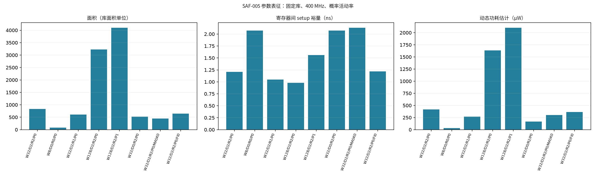

# SAF-005 PPA 表征报告

本报告由 `characterization/scripts/extract_ppa.py` 从原始报告生成。

## 条件与证据范围

DC V-2023.12-SP3；GF CMOS28LP SC9 HVT，TT 1.00 V/25 °C；400 MHz。
输入/输出延迟 0.25 ns，时钟不确定性 0.05 ns，输入 transition 0.05 ns，输出 load 0.01 pF。
输入概率 0.5、toggle_rate 0.1；无 SAIF，时序单元活动由工具传播估计。功耗包括时钟相关单元内部功耗。
数据来自固定库的探索性综合；当前工作树未锁定发布，不能作为物理签核或 qualified 结论。
面积按 Liberty 库面积数值报告，不擅自转换为物理版图面积。层次保留、禁跨边界优化、无 retiming。

## 测量结果

| 配置 | 面积（库单位） | 寄存位 | 全路径裕量 ns | 寄存器间裕量 ns | 动态 µW | 漏电 nW |
|---|---:|---:|---:|---:|---:|---:|
| W32/D2/R2/P0 | 829.530 | 166 | 0.66 | 1.21 | 418.522 | 154.696 |
| W8/D0/R0/P0 | 81.198 | 9 | 0.67 | 2.07 | 30.948 | 14.772 |
| W32/D2/R1/P0 | 610.038 | 100 | 0.66 | 1.05 | 269.072 | 115.508 |
| W128/D2/R2/P0 | 3227.796 | 646 | 0.39 | 0.98 | 1636.700 | 604.314 |
| W128/D2/R2/P1 | 4097.808 | 902 | 1.25 | 1.56 | 2100.600 | 747.761 |
| W32/D0/R2/P0 | 523.107 | 34 | 0.67 | 2.07 | 167.745 | 103.312 |
| W32/D2/R2/P0/MASK0 | 444.717 | 132 | 1.61 | 2.13 | 299.659 | 78.225 |
| W32/D2/R2/P0/FI0 | 646.308 | 166 | 0.91 | 1.22 | 365.818 | 113.104 |

## 结构验收与选择边界

逐点检查 A/B 独立层次和延迟寄存位：Level 2 两套、Level 1 一套、Level 0 无 B；D=0 无延迟寄存器。
所有检查基于映射后报告，寄存器数量不能替代布线/布局的物理独立性证明。
LINT-28 为参数裁剪后的未用端口；LINT-29 为零延迟直通；LINT-31 为 fail-safe 公式优化后的同值输出；LINT-33 为多个未用端口接同一常量。详见 lint 说明。
不同冗余级别和掩码配置具有不同安全覆盖，不能在单一 Pareto 集中互相替代。
W128/R2/D2 的 P0/P1 可比较面积、功耗与时序，但 P1 额外增加一个周期检测延迟，选择需满足系统故障反应时间。
默认安全配置保留 R2/D2/P0；R0 仅用于非安全调试。静态全 mask 用于证明裁剪，不可作为安全检测配置。

## 可复现性

运行目录 ID、每点参数与全部报告 SHA-256 见 [ppa-summary.json](ppa-summary.json)。原始库路径和商业工具日志仅保留在本地 build/eda。
