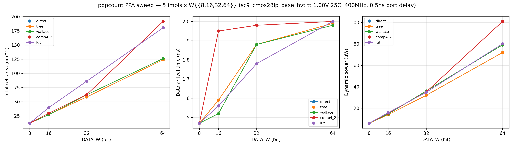

# popcount PPA 表征报告（G6）

> 综合工具：DC `dc_shell`（V-2023.12-SP3）；工艺：`sc9_cmos28lp_base_hvt`
> tt_1p00v_25c；约束：400MHz（2.5ns）、端口延时 0.5ns、BUFH 驱动、0.01 负载。
> 数据点：五实现 × DATA_W∈{8,16,32,64}（`characterization/synth_sweep.tcl`）。
> 证据目录：`build/eda/ppa/run-20260828-01/`。

## 1. 结论速览

- **时序**：`lut` 关键路径最短（W=32: 1.78ns；W=64: 2.00ns），结构规整；
  `wallace`/`tree` 次之；`comp4_2` 在 W=64 时最深（2.00ns，4:2 列间链较长）。
- **面积**：`direct`/`tree` 最小（DC 将串行链优化为树后二者一致）；`wallace`
  中位；`comp4_2`/`lut` 较大（W=64: 191.6 / 180.4）。
- **功耗**：`direct`/`tree` 动态功耗最低（W=64: 71.95μW）；`comp4_2` 最高
  （W=64: 100.97μW，+40% vs tree，面积/功耗双差）；`wallace`/`lut` 居中
  （79.08 / 80.11μW）。漏电占比极小（<0.04%），动态功耗主导，随面积同趋势。
- **重要发现**：`compile_ultra` 对 `+` 加法链做了重新关联化，使 `direct`（串行
  链）与 `tree`（显式折半）综合结果一致——**串行链基线在逻辑综合层面被自动
  优化为树**。这是有效 PPA 数据（证明 RTL 结构经综合收敛），但也说明：若需
  保留"最差基线"，需 `set_dont_touch`/`compile -map_effort` 保护或改用门级约束。
- **权衡建议**：面积/功耗优先小位宽 → `tree`/`wallace`；时序敏感 → `lut`；
  通用默认 → `tree`（任意位宽，综合后面积/时序/功耗与 wallace 相当或更优，
  且 comp4_2 在 W=64 面积 +54%/功耗 +40% 无补偿优势）。

## 2. 实测数据（sc9_cmos28lp_base_hvt tt_1p00v_25c, 400MHz, 0.5ns 端口延时）

**PPA 对比图**（面积/时序/动态功耗 × DATA_W，按实现分线；
由 [`characterization/plot_ppa_comparison.py`](../characterization/plot_ppa_comparison.py) 生成）：

**面积（Total cell area, μm²）**

| impl | W=8 | W=16 | W=32 | W=64 | 趋势 |
|---|---|---|---|---|---|
| direct | 12.05 | 27.26 | 58.50 | 124.02 | ~O(W) |
| tree | 12.05 | 27.26 | 58.50 | 124.02 | ~O(W)（与 direct 相同，DC 优化收敛） |
| wallace | 12.05 | 27.14 | 62.24 | 126.13 | ~O(W) |
| comp4_2 | 12.05 | 29.60 | 62.71 | 191.65 | 高 W 增长快 |
| lut | 12.05 | 39.55 | 86.35 | 180.41 | 高 W 增长快 |

**时序（data arrival, ns）**

| impl | W=8 | W=16 | W=32 | W=64 |
|---|---|---|---|---|
| direct | 1.47 | 1.59 | 1.88 | 1.99 |
| tree | 1.47 | 1.59 | 1.88 | 1.99 |
| wallace | 1.47 | 1.52 | 1.88 | 1.98 |
| comp4_2 | 1.47 | 1.95 | 1.98 | 2.00 |
| lut | 1.47 | 1.56 | 1.78 | 2.00 |

> 所有数据点 slack≥0（400MHz 下收敛）。证据目录 `build/eda/ppa/run-20260828-01/`。

**动态功耗（Total Dynamic Power, μW；`report_power -analysis_effort low`，0 活动默认）**

| impl | W=8 | W=16 | W=32 | W=64 | 趋势 |
|---|---|---|---|---|---|
| direct | 6.03 | 13.96 | 32.09 | 71.95 | ~O(W)（与 tree 一致） |
| tree | 6.03 | 13.96 | 32.09 | 71.95 | ~O(W) |
| wallace | 6.04 | 14.65 | 36.16 | 79.08 | ~O(W) |
| comp4_2 | 6.04 | 15.44 | 35.25 | 100.97 | 高 W 增长最快（+40% vs tree） |
| lut | 6.03 | 15.85 | 34.95 | 80.11 | ~O(W) |

**漏电功耗（Cell Leakage Power, nW）**：W=64 时 direct/tree 27.24、wallace 27.57、
lut 31.48、comp4_2 49.30；占总功耗 <0.04%，HVT 库 + 28nm 下动态功耗绝对主导，
跨实现漏电差异与面积同趋势，不单独影响选型。

> **功耗上下文声明**：`report_power` 未施加 activity（翻转率）文件，为
> 默认概率传播估计（E2 等级）；用于**实现间相对比较**有效，绝对值需在
> 消费者上下文（真实 activity/SAIF）下重估。

> **时序读数纪律**：W16–W64 各实现 arrival 逼近 2.00ns 上界，为 400MHz 约束下
> 的**收敛天花板**（required = 2.5 − 0.5 = 2.0ns；DC 满足即停，非真实延迟极限）。
> 未触顶点（W8 全列、wallace W16=1.52）才反映真实逻辑深度；实现间 fmax 对比
> 需周期扫描（后续 G6 优化项）。

## 3. 敏感度分析

- **direct vs tree 趋同**：`compile_ultra` 对 `+` 链的重新关联化使两种手写结构
  收敛为同一网表；若要度量"原始 RTL 结构"差异需关闭算术优化。
- **wallace/comp4_2 生成网表**：门级扁平 assign 结构在综合后接近 DC 自身优化
  结果（wallace W=32 面积 62.24 vs direct 58.50），说明生成结构合理。
- **lut 高 W 面积激增**：W=64 时 180.4（+45% vs tree），因 4bit 查表真值表+合并
  树在综合映射后未显著复用；小位宽（W≤32）时序仍最优。
- **收尾 ripple-carry**：wallace/comp4_2 收尾为时序瓶颈；换 carry-lookahead 可
  进一步降关键路径（后续 G6 优化项）。

## 4. 参考

- [`characterization/synth_sweep.tcl`](../characterization/synth_sweep.tcl)
- [`characterization/plan.yaml`](../characterization/plan.yaml)
- [`profiles.yaml`](../profiles.yaml)（画像 → 推荐实现）
- 证据目录：`build/eda/ppa/run-20260828-01/*_summary.txt`
